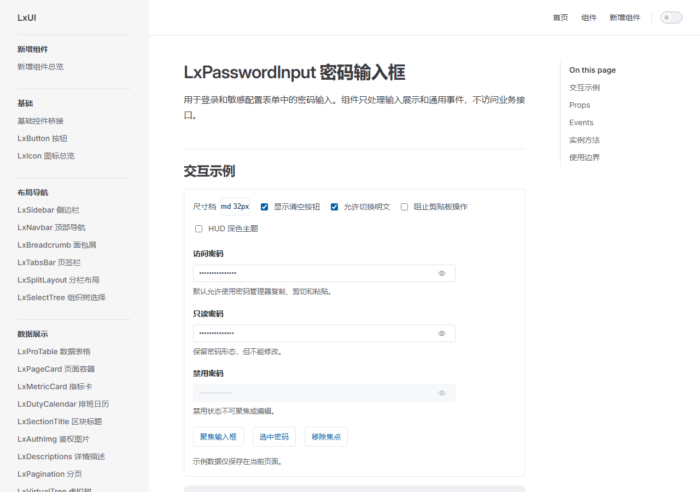
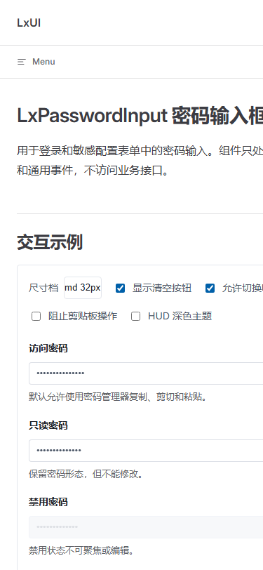

# LxPasswordInput 独立设计评审（Assessment A）

**范围**：`linkx-fe/src/components/LxPasswordInput/index.vue`、`demo/basic.vue`、`linkx-fe/docs/components/lxpasswordinput.md`；页面 `http://127.0.0.1:4195/components/lxpasswordinput.html`。

**方法**：独立设计评审子任务；在新建的 Codex In-App Browser 标签检查桌面页面及交互。另用全新 Edge headless profile 捕获 1280×900 桌面和 375×812 窄屏截图。未读取 detector 输出、Assessment B 文件、综合报告或既有 wave1 评审文件；未修改产品源码。

**依据**：`design/表单控件八件套/code.html` 与 `screen.png`；`doc/lx-ui/DESIGN.md`、`doc/lx-ui/DESIGN-SPEC.md`；目标组件、Demo 和组件文档。当前页面是组件文档和示例，按 **Read** 模式评估；不把它当成真实登录表单。

## 设计特异性

**判断：中等，产品身份主要由令牌和功能边界承载。** 输入框采用 Lx 的 28/32/40px 尺寸、4px 圆角、蓝色焦点态和 HUD 令牌，密码遮罩、眼睛图标和中文说明也与任务吻合。页面整体仍是可被其他 Vue/Element Plus 组件库复用的 VitePress 文档壳与通用表单标本；LinkX 的警务管理产品语境没有进一步影响该组件的视觉表达。对通用组件文档而言，这种克制合理，不需要为“特异性”增加装饰。

## Nielsen 启发式评分

| # | 启发式 | 分数 | 依据 |
|---|---|---:|---|
| 1 | 系统状态可见性 | 3/4 | 显隐图标与可访问名称随状态变化；Demo 也会反馈聚焦、失焦和清空。明文显隐本身不进入 Demo 的 live status。 |
| 2 | 系统与现实世界匹配 | 4/4 | 密码默认遮罩、眼睛显隐、只读/禁用标签和剪贴板说明都使用熟悉且准确的表达。 |
| 3 | 用户控制与自由 | 3/4 | 提供显隐、清空、尺寸选择以及 focus/blur/select 方法；此类控件不需要撤销流程。 |
| 4 | 一致性与标准 | 3/4 | 常规样式符合 Lx 输入框令牌；HUD 示例中输入框转深色而外层及文字仍偏亮色。 |
| 5 | 错误预防 | 3/4 | 默认遮罩、最大长度和可选剪贴板拦截有助于减少意外；`minlength` 仍需宿主表单校验，文档对此有说明。 |
| 6 | 识别而非记忆 | 3/4 | 字段有标签，显隐图标带动态无障碍名称，剪贴板策略有文字提示；Demo 配置项集中可见。 |
| 7 | 灵活性与效率 | 3/4 | 支持三档尺寸、键盘操作、密码管理器策略及公开实例方法。 |
| 8 | 美观与极简 | 3/4 | 控件自身干净、密度适中；窄屏文档示例横向裁切，HUD 预览也未完整换肤。 |
| 9 | 错误识别、诊断与恢复 | 2/4 | 密码策略与无效值恢复由宿主处理；当前 Demo 没有提交或校验错误示例，组件文档说明了职责边界。 |
| 10 | 帮助与文档 | 3/4 | Props、事件、实例方法及安全边界都有说明；内容易查，但示例没有展示宿主校验集成。 |
| **合计** |  | **30/40（75%，Good）** | 按完整 10 项评分。 |

## 认知负荷

Demo 主字段本身负荷低：标签、遮罩值、一个显隐按钮和一行提示。文档页的示例工具栏同时呈现 5 个决策项：尺寸、清空、允许显明文、阻止剪贴板、HUD 主题；这超过 4 项的参考阈值。它们服务于组件探索，分组清楚，但仍占据主要字段之前的视觉位置。

认知负荷清单：

- [x] 单一焦点：主字段仍是示例核心。
- [ ] 分块：工具栏同组含 5 项，略超过每组 4 项。
- [x] 分组：工具项与字段、只读/禁用样例有边界。
- [x] 视觉层级：标题、字段标签和说明容易扫读。
- [x] 一次一事：控件样例不要求用户并行完成多个业务任务。
- [ ] 最少选择：工具栏有 5 个同时可见的配置选择。
- [x] 工作记忆：无需记住前一页的信息才能操作。
- [x] 渐进呈现：Props、Events 和使用边界按文档章节向下展开。

**失败 2/8，属中等负荷。** 此处两项都来自同一组 Demo 控件，属于示例面板的密度，不代表生产密码表单本身有 5 个决策。

## 情绪路径

进入页面后，说明把用途限定在登录和敏感配置，建立了正确预期。字段先以遮罩显示，用户主动点眼睛后才看到明文；图标与无障碍名称同步改变，Space 也能完成切换，动作有明确反馈。只读字段仍可查看明文，禁用字段的眼睛和输入均禁用，状态差异清楚。

主要情绪谷是隐私暴露时长：实测将访问密码切为明文，再把焦点移到标题后，输入内容仍保持可读，直到再次手动切换。用户离开字段或被打断时没有自动恢复遮罩。是否采用自动失焦遮罩是安全与连续操作之间的产品选择，应有明确约定。

## 做得好的地方

1. 默认保持密码遮罩，明文只能由显式控件开启；控件状态有动态标签，鼠标点击和 Space 操作均可观察到结果。
2. 只读与禁用不是单靠颜色区分：只读字段仍能聚焦并查看，禁用字段和显隐控件都不可用；桌面焦点环清楚。
3. 文档把 `type`、`autocomplete`、`preventClipboard`、`minlength` 与宿主职责说明白，没有把前端拦截描述成安全边界或把原生属性误称为业务校验。

## 优先问题

1. **[P2] 375px 页面宽度下，文档示例被横向裁切。** 窄屏截图中标题单行超出视口，Demo 面板和工具栏右侧选项、字段也被截掉，手机读者无法完整查看示例。请检查文档内容容器与 Demo 外层的最小宽度，令网格列可收缩到 `minmax(0, 1fr)`，并在 480px 内把工具项和操作目标分行；同时验证页面没有整体横向溢出。
2. **[P2] HUD 示例只让输入控件变暗，外层仍是亮色。** 页面实测可见深色输入框嵌在白色 Demo 面板中，标签和说明仍混用 Element Plus 与 Lx 亮色文字令牌，主题呈现不完整。请让 Demo 容器、标签、辅助文字和输入框从同一套 HUD 令牌取值，或在主题边界同步映射 `--el-*` 与 `--lx-*` 变量。
3. **[P2] 明文状态在失焦后持续暴露。** 实测点击“显示密码”后再移焦，`LinkX-Demo-2026` 仍明文可见，且状态没有其他提示。对于敏感配置表单，被打断或切换任务时可能把密码留在屏幕上。请明确采用失焦即遮罩还是保留显式关闭；若保留，应在文档说明持续规则，并考虑给高安全调用方提供失焦遮罩策略。

## 用户画像红旗

- **Jordan（初次使用者）**：访问密码标签和眼睛图标符合直觉；没有明显术语障碍。窄屏文档标题及配置行被裁切，会妨碍完整浏览和理解。
- **Sam（键盘/读屏用户）**：字段名与显隐状态名称出现在浏览器可访问性树；Space 实测可切换，焦点环可见。树中显隐控件映射为带名称和状态的 checkbox；没有用 NVDA、VoiceOver 实测它是否按预期宣布为切换按钮，需视为验证边界而非已确认缺陷。
- **Casey（移动端用户）**：源码在 480px 内把显隐按钮扩大到 44×44px；但 375px 页面截图里工具栏、输入区和标题发生横向裁切，浏览 Demo 时需要横向移动视口，容易中断。

## 次要观察与证据限制

- 访问密码默认遮罩；点击眼睛显示明文、再次操作恢复遮罩。只读密码也实测可显明文；禁用字段与眼睛按钮在可访问性树中为 disabled。
- 尺寸下拉实际切换到 `sm 28px`，初始 `md 32px`；源码和文档提供 `lg 40px`。设计源 `code.html` 的表单基准为 32px、圆角 4px，与默认态一致。
- 剪贴板复选框切换后，提示由“默认允许使用密码管理器复制、剪切和粘贴”改为“当前已按宿主策略阻止复制、剪切和粘贴”，再恢复默认。源码将同一策略绑定到 copy/cut/paste 事件。没有执行系统剪贴板读写，因此浏览器真实复制/剪切/粘贴是否被阻止未实测。
- `type` 透传由源码删除 `attrs.type` 并绑定显隐状态决定；页面默认遮罩和显明文样例与之吻合。Demo 未构造调用方外传 `type="text"` 的场景。
- `prefers-reduced-motion` 有源码规则，但本次没有模拟系统减少动效偏好；该控件显隐没有明显动效可供视觉判断。
- 未使用真实 NVDA/VoiceOver；可访问性证据来自浏览器可访问性树与 Space 键操作。桌面交互在 Codex In-App Browser 新标签中检查；保存的两张截图由独立 Edge headless profile 捕获。

## 待讨论的问题

1. 在敏感配置场景中，显明文是否应该在输入框失焦时自动遮罩？
2. HUD 主题的职责边界应放在 Demo 容器，还是由统一主题同时映射 Element Plus 与 Lx 令牌？
3. 示例工具栏是否应把剪贴板和主题选项折叠为高级设置，以减少首屏的五项选择？

## 截图

桌面页面（1280×900，亮色主题，md 尺寸）：

375px 窄屏页面（812px 高）：

