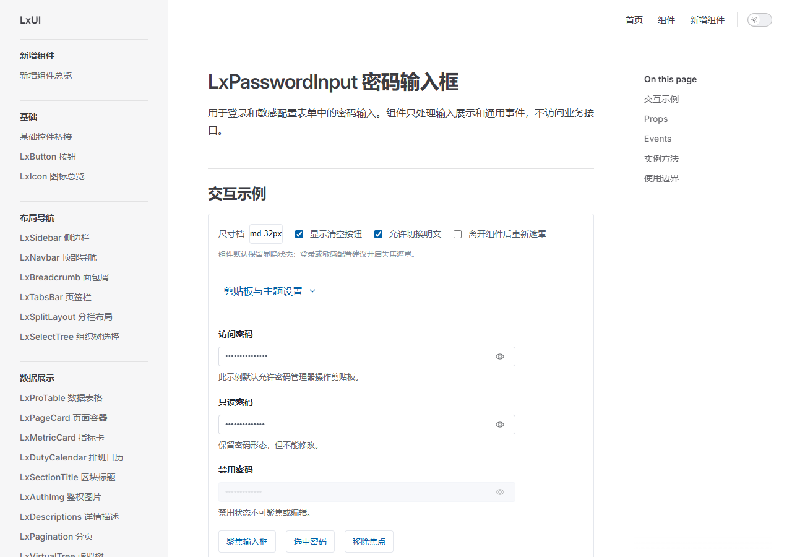
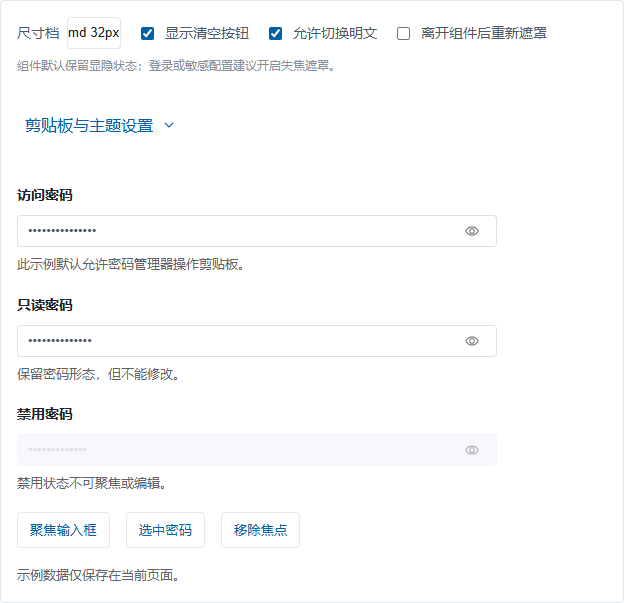
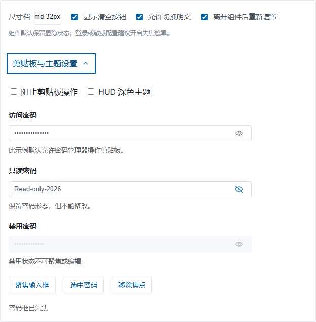
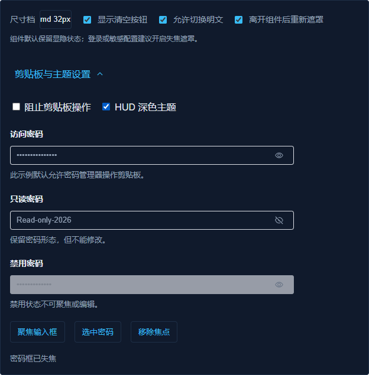
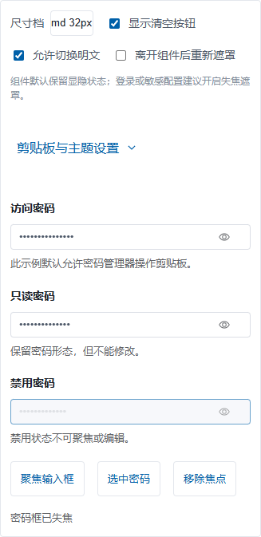
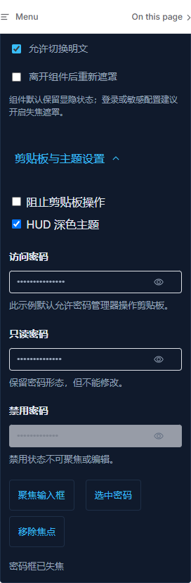
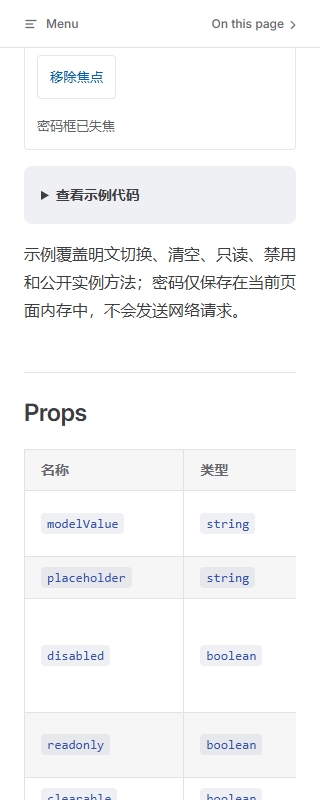

方法：独立 Assessment A（使用全新 Playwright context/page 做设计与 UX 观察；本任务限定为 A-only，未运行 Assessment B、Detector 或代码复核）。

# LxPasswordInput 文档页设计评审

**目标**：`linkx-fe/docs/components/lxpasswordinput.md` 及其内嵌 `LxPasswordInput` Demo。页面属于 Read 模式，评审重点是理解、比较组件状态和安全边界。

## 独立设计特异性判断

**中等偏高，内容比外壳更有 LinkX 特异性。** 密码输入、失焦遮罩、密码管理器剪贴板策略、只读/禁用状态，以及 `sm/md/lg` 令牌都直接对应 LinkX 的组件契约；安全提示和中文 API 表也针对真实集成任务。文档站的左侧目录、右侧页内目录、白色内容区仍是常见 VitePress 组件库结构，视觉语言主要靠 LinkX 令牌与组件本身体现，尚不是一眼可辨的独特信息架构。

这项判断在查看任何自动扫描结果之前完成；本次未读取或运行 Detector 证据。

## Design Health Score

| # | Nielsen 启发式 | 分数 | 观察 |
|---|---|---:|---|
| 1 | 系统状态可见性 | 3 | 显隐按钮图标与 `aria-pressed` 即时变化；Demo 另有实时状态说明。 |
| 2 | 贴近真实世界 | 4 | 密码、显隐、只读、禁用和密码管理器等词汇直接，眼睛图标符合常用隐喻。 |
| 3 | 用户控制与自由 | 3 | 可显隐、清空、聚焦、选中、移焦；主要状态可逆。 |
| 4 | 一致性与标准 | 3 | 继承 LinkX/Element Plus 控件语言，并采用原生 checkbox、select、`details` 键盘习惯；文档外壳仍是通用模板。 |
| 5 | 错误预防 | 3 | 标签、长度说明、只读/禁用示例和安全提示能减少误解；敏感场景需主动开启 `maskOnBlur`。 |
| 6 | 识别而非记忆 | 2 | 桌面信息可见；320px 下 Props 表有 917px 内容宽度，首屏只露出前两列且没有明显横向滚动提示。 |
| 7 | 灵活与高效 | 3 | Enter/Space 可切换显隐，公开实例方法也有现场按钮演示；没有额外的键盘快捷操作需求。 |
| 8 | 美观与简约 | 3 | 留白、分组和控件密度总体平衡；Demo 同时呈现多种状态与实例方法，主输入的视觉优先级略被稀释。 |
| 9 | 错误识别与恢复 | 2 | 清空与状态反馈可用，但 Demo 不展示输入错误/恢复路径；提交校验由宿主处理的边界虽有说明，恢复体验未展示。 |
| 10 | 帮助与文档 | 3 | 中文 Props、Events、实例方法和使用边界齐全；窄屏表格需要用户自行发现横向滚动。 |
| **合计** |  | **29/40（72.5%，Good）** | 两项较弱点集中在窄屏 API 表的可发现性和错误恢复示例。 |

## 认知负荷

按 Critique 的 8 项清单，**1 项失败，整体低负荷**。分组、分块、层级、一次一项、最少选择、工作记忆和渐进披露均通过：初始工具栏有 4 个控制，剪贴板与主题设置折叠后再显示 2 项；字段标签与提示就近出现。单一焦点未完全通过：密码输入之外，Demo 还同时展示三个字段状态和三个人工调用按钮，第一次读页面时需要先判断自己应关注哪个例子。对组件 API 展示来说这是可理解的取舍，但主输入并非唯一视觉焦点。

## 情绪路径

标题和首段先交代这是登录/敏感配置用的密码控件，随后能直接试显隐，反馈清楚；开启 `maskOnBlur` 后，组件内部从输入框转到眼睛按钮会保留明文，真正离开组件才遮罩，行为连贯且能带来安全感。紧张点在于默认设置仍不遮罩，而提示要求登录场景主动开启；赶时间复制示例的开发者可能只记住组件可用，遗漏安全选项。只读和禁用态的视觉差异明确，减少了误操作焦虑。

## 做得好的地方

- 安全说明就在控件附近，明确指出默认行为、敏感场景建议和剪贴板许可，文档后面的使用边界再次说明前端事件拦截不是安全边界。
- 可见/遮罩态既有眼睛图标变化，也有 `aria-label` 和 `aria-pressed`；实测 Enter 与 Space 都能切换，键盘焦点可见。
- 375px 与 320px 下显隐按钮和 disclosure summary 均为 44px 高；只读、禁用状态以及 HUD 深色预览仍能区分，页面根宽度没有横向溢出。

## 优先问题

1. **[P2] 敏感场景的安全设置仍依赖集成者主动发现。** `maskOnBlur` 初始关闭，提示虽写明登录或敏感配置建议开启，Demo 的开关和示例代码初始值仍为关闭。匆忙复制示例时，明文可能在焦点离开后持续显示。保留组件现有默认值的兼容性，同时提供一个默认启用失焦遮罩的登录示例，或让复制区直接突出这一配置。建议：`/impeccable clarify`。
2. **[P2] 320px 下 API 表横向内容缺少可见提示。** Props 表的 `scrollWidth` 为 917px、可视宽度为 272px；截图中只看到名称和类型列，默认值、说明等列需要横向滑动才能发现，静态截图没有滚动条或边缘提示。考虑窄屏改为属性行卡片，或提供持续可见的横向滚动线索。建议：`/impeccable adapt`。
3. **[P2] 320px 下固定移动导航会遮住演示区顶部。** 在 320×800 视口将 Demo 滚入视野时，Demo 顶边位于 y=18、工具栏位于 y=31，而固定移动导航占据页面顶部；截图可见首行设置被导航压住。应给目标区留出固定栏偏移，或调整锚点/滚动定位，让首行完整露出。建议：`/impeccable adapt`。

## Personas

- **集成登录表单的开发者**：能从 Props 和使用边界找到参数与宿主校验责任；风险是复制 Demo 时 `maskOnBlur` 初始为关闭，需留意附近的安全提示并主动改配置。
- **配置敏感凭据的管理员**：显隐按钮易辨认，键盘切换有效；启用失焦遮罩后，实测离开输入框会恢复遮罩，组件内转到显隐按钮则保留状态。风险同样是安全行为需要先启用。
- **320px 窄屏文档读者**：44px 操作热区可点，根页面无横向溢出；但固定导航遮挡 Demo 首行，Props 表其余列要横向滑动且提示不足，首次发现能力较弱。

## 次要观察

- “剪贴板与主题设置”作为原生 disclosure 可用键盘 Space 展开，折叠图标在闭合/展开状态可见，展开时旋转方向正确；焦点环清楚。320px HUD 截图中图标没有遮挡标题。
- HUD 开关只改变 Demo 区域，不改变文档站整体主题。现有“HUD 深色主题”能表达主题种类，但未明确写出“仅此示例”，页面顶部另有文档主题开关；作用范围有轻微歧义，可改成“本示例 HUD 深色主题”。
- `prefers-reduced-motion: no-preference` 与 `reduce` 两种媒体状态都实际模拟。reduce 下 disclosure 图标和显隐按钮的计算过渡时间为约 `0.00001s`，视觉上近似关闭动效；没有发现明显的运动残留。
- 375px/320px 下文档根宽度分别为 375px/320px，未出现页面级横向溢出；Props 表自身横向滚动是局部溢出。

## 未验证项与结论边界

- 本轮没有直接采集 375px 或 320px 的页面首屏标题截图，也没有记录标题框尺寸；**窄屏 H1 是否换行自然、是否与页内目录/导航重叠目前未验证，不能判为通过**。桌面首屏标题清晰。
- 浏览器 Console 出现一条通用资源 404 文本，但响应监听没有捕获对应 URL，因此来源未定位；没有页面异常或失败请求记录。该项不作为已证实的组件缺陷。
- 浏览器证据来自 Playwright 1.58.0 驱动的 Chrome 154 桌面视口模拟；未做真实触屏设备、屏幕阅读器或 Safari 验收。Demo 数据保存在页面内存；本轮不代表真实认证或后端安全联调。
- 按任务范围未运行 Assessment B、Detector，也未读取其他 Assessment 或代码复核记录。

服务使用 `pnpm dev --host 127.0.0.1 --port 4182 --strictPort` 启动；采集结束后向 exec session `30208` 发送 Ctrl+C，session 以中断状态退出。随后检查 `Get-NetTCPConnection -State Listen -LocalPort 4182` 无监听记录，监听 PID `15008` 也已不存在。

完整浏览器状态与尺寸数据见 [browser-evidence.json](./browser-evidence.json)；截图均保存在本目录。

### 截图

桌面文档首屏与默认遮罩态：

Disclosure 展开、键盘焦点环与 HUD 预览：

375px 与 320px 窄屏视图：

