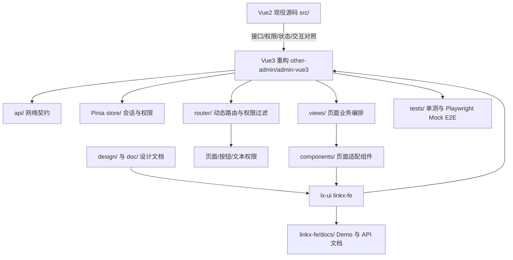

# LinkX 项目地图

本文是项目定位入口。新增模块、路由、公共组件或 API 后，先更新本文件，再补实现和测试证据。

## 组件库执行点

组件与图标迁移严格按顺序执行：`design/` 基础控件与动态图标 → `LxDynamicForm` → 其他 lx-ui 组件及 Impeccable 组件/动效审查 → Vue3 Element Plus 替换；全量替换后再审查整站。基础控件桥接、动态图标和 `LxDynamicForm` 已有库级证据；当前继续闭环实际宿主候选。`LxSectionTitle` 已完成 size/tag/tagType 设计映射、独立 API/Demo、13 项单测和 320/375px 文档浏览器验收；配置页真实组合回归仍待 UI-04。`LxIcon` 已按 Impeccable 预检建议采用自然减速曲线，`LxUpload` 进度已使用 transform 并尊重减少动效。`LxMetricCard` 已对照设计稿补齐独立中文 API/Demo、语义色、LxIcon 趋势箭头、进度可访问性，并兼容旧宿主 props/slots；Vue3 详情抽屉 6 处仍待后续替换回归。`LxAuthImg` 已补独立 API/Demo、Blob 请求注入、取消竞态与对象 URL 回收证据；Vue3 鉴权适配器仍待后续替换波次。组件证据、接入位置与状态见 `doc/PROJECT-DELIVERY-PLAN.md`、`linkx-fe/docs/ROADMAP.md` 和 `other-admin/admin-vue3/docs/ELEMENT-PLUS-LX-UI-MATRIX.md`。

`LxEmpty` 已按 lx-ui 空态规格补齐默认/紧凑尺寸、`imageSize` 兼容和 `default`/`footer` 插槽；阶段性启发式评审曾记录 28/40 与 34/40，浏览器 overlay 的 8 条发现中 5 条确认是低对比度文本，已改用正文令牌并补筛选恢复、双主题对比度浏览器断言。后续流程核验发现这些评分没有正式 Impeccable Critique 快照，设计评审也未在独立新标签检查页面，因此只作为阶段性证据，UI-11 正式审查仍待按 skill 规范完成。源码 CLI `detect.mjs` 返回 `[]` 只代表目标源码静态规则零命中；URL CLI 还必须核对 stderr 和退出码，Puppeteer 缺失时即使 stdout 为 `[]` 也属于扫描失败。Vue3 的 15 处 `el-empty` 仍待 UI-04 替换。

`LxIcon` 图标总览页已完成一次正式双路 Critique，27/40，快照为 `.impeccable/critique/2026-09-27T22-24-39Z__linkx-fe-src-components-lxicon-index-vue.md`。源码 detector `[]` 只表示静态规则零命中；浏览器 overlay 的细项数与标题数不一致，且命中主要来自 VitePress 外壳。主会话在真实浏览器验证 `delete` hover 动画和减少动效；键盘焦点已改为贴合卡片本体的 2px 主题色边框，并由文档 E2E 验证尺寸不变。暗色标题对比、长分组、尺寸契约和其他图标动效仍需处理；整库 UI-11 继续待 UI-10 候选闭环。

## 目录职责

| 目标               | 位置                                                                                  | 先查什么                                                                                                                                                                                                                                                                                                                                                                                                                                                                                                                                                                                                                                                                                                                                                                                                                                                                     |
| ------------------ | ------------------------------------------------------------------------------------- | ---------------------------------------------------------------------------------------------------------------------------------------------------------------------------------------------------------------------------------------------------------------------------------------------------------------------------------------------------------------------------------------------------------------------------------------------------------------------------------------------------------------------------------------------------------------------------------------------------------------------------------------------------------------------------------------------------------------------------------------------------------------------------------------------------------------------------------------------------------------------------- |
| 页面行为迁移       | `src/views`、`other-admin/admin-vue3/src/views`                                       | Vue2 同名页面、路由入口、权限键、API                                                                                                                                                                                                                                                                                                                                                                                                                                                                                                                                                                                                                                                                                                                                                                                                                                         |
| 网络协议           | `other-admin/admin-vue3/src/api`                                                      | Vue2 API 文件、请求方法、字段和状态值                                                                                                                                                                                                                                                                                                                                                                                                                                                                                                                                                                                                                                                                                                                                                                                                                                        |
| 登录与账号隔离     | `other-admin/admin-vue3/src/views/login`、`src/utils`、`store/modules`、`router`      | OAuth、记住账号名、改密/License 流程；登录设计参考见 `doc/登录1/`、`doc/登录2/`，落地见交付计划 UI-05                                                                                                                                                                                                                                                                                                                                                                                                                                                                                                                                                                                                                                                                                                                                                                        |
| 页面/按钮/文本权限 | `src/router/filterChain.ts`、`src/composables/usePermission.ts`、`src/directives`     | 菜单 URL、`permissions.menus`、`permissions.actions`、管理员例外                                                                                                                                                                                                                                                                                                                                                                                                                                                                                                                                                                                                                                                                                                                                                                                                             |
| 复用逻辑           | `src/utils`、`src/composables`                                                        | 是否有响应式/生命周期副作用，再决定放置位置；`useFetch`、`useTable` 请求规则见 CODE-01 与根 `AGENTS.md`                                                                                                                                                                                                                                                                                                                                                                                                                                                                                                                                                                                                                                                                                                                                                                      |
| 通用 UI 与图标     | `linkx-fe/src/components`、`linkx-fe/src/components/LxIcon`、`design/`、`doc/LxIcon*` | 优先复用 lx-ui；94 个标准图形提供 96 个名称；P0/P1/29 枚共 69 个去重动效名称已有单测和桌面/触屏浏览器证据。基础控件桥接页已覆盖按钮、表单八件套、Tabs、Card、Tree、Descriptions，并完成桌面、HUD 深色和 375px 检查；`LxDynamicForm` 已完成独立 Demo/API、Mock 成功/空/错、联动、禁用、重置、栅格和 375px 检查；`LxStatusSwitch` 已完成独立 API/Demo、6 项单测和 3 项文档 Playwright，覆盖确认/取消、旧值映射、只读、失败恢复、对比度、焦点、44×44px 窄屏点按区和减少动效；`LxSelectPagination` 已补设计稿要求的 targetMap 回显、300ms 防抖、取消旧请求、标签折叠及 3 项文档 Playwright。Vue3 首批已接入侧栏、Navbar、SearchBar、GroupTags 图标及 SectionTitle 适配器；StatusSwitch 等候选尚待宿主替换，矩阵见 `other-admin/admin-vue3/docs/ELEMENT-PLUS-LX-UI-MATRIX.md`。组件库完成后做 Impeccable 组件/动效审查，宿主完成后做全站审查；Vue2 页面迁入 Vue3 时直接采用 lx-ui |
| 组件示例           | `linkx-fe/docs/components`                                                            | Props、事件、插槽、暴露方法及状态演示                                                                                                                                                                                                                                                                                                                                                                                                                                                                                                                                                                                                                                                                                                                                                                                                                                        |
| 迁移证据           | `other-admin/admin-vue3/docs`、`tests`                                                | 台账状态和对应测试，不以源码存在推断完成                                                                                                                                                                                                                                                                                                                                                                                                                                                                                                                                                                                                                                                                                                                                                                                                                                     |

lx-ui 当前执行顺序固定为 `design/` 基础控件与动态图标 → `LxDynamicForm` → 其他宿主候选组件、完整库级验收和 Impeccable 审查 → Vue3 Element Plus 组件替换。前两项库级浏览器验收已完成；SearchBar 已补 3 项行为测试及成功/空/错、失败恢复和 375px 全字段浏览器证据；Dialog 已补 4 项行为测试和 3 项文档 Playwright；ProTable 已补跨页选择修复、加载/减少动效、空错恢复、排序、375px 方向键滚动/44px 点按及 HUD 主题 4 项文档 Playwright；SelectPagination 已补 3 项文档 Playwright，覆盖跨页回显、取消、错误恢复和 375px 触屏；Upload 已补 4 项单测、3 项文档 Playwright；Descriptions 已补 6 项单测、3 项文档 Playwright，并完成组件级 Impeccable 定向检查；StatusSwitch 已补 6 项单测、3 项文档 Playwright；AuthImg 已补 6 项单测、3 项文档 Playwright，覆盖 Blob Mock、取消竞态、资源清理、失败回退和 375px/HUD/减少动效；LxSidebar 键盘分组/rail 焦点、移动模态抽屉和减少动效文档 E2E 2/2 通过。整库 Impeccable 审查尚未完成，Vue3 批量替换仍须等待 UI-10/UI-11 门槛。详细状态见 `linkx-fe/docs/ROADMAP.md` 和 `other-admin/admin-vue3/docs/MIGRATION-BACKLOG.md`。

`LxActionButtons` 已补 disabled 原生语义、键盘可操作的溢出项、Escape 焦点恢复和 375px 浏览器验收（3 项单测、3 项 Playwright，含 44×44px 点按与焦点/外部点击收起）。Vue3 29 处宿主 `ActionButtons` 尚未替换，适配契约见 `ELEMENT-PLUS-LX-UI-MATRIX.md`；本步仍在组件库阶段，不改变既定 Impeccable 和替换门槛。

`LxSplitLayout` 已补独立中文 API/Demo、3 项宿主单测和 3 项文档 Playwright；修复折叠时主区换行，并验证桌面拖动/键盘限宽、375px 纵向布局、表格局部滚动、HUD 深色与减少动效。宿主业务页面仍未采用该组件；UI-11 整库 Impeccable Critique 仍待 UI-10 完成，detector `[]` 不作为审查通过。

`LxDutyCalendar` 已补独立中文 API/Demo、8 项单测和 3 项文档 Playwright，验证 42 格网格、日期键盘导航、跨月焦点、插槽、空/加载/失败/只读宿主状态、375/320px、HUD 深色和减少动效。它是通用展示组件，未发现专属 `design/` 日历稿；Vue3 排班页现有 `DutyCalendar.vue` 仍依赖班次详情 popover、loading、月份查询事件和实例方法，UI-04 需要保留旧契约的适配层，不能直接替换。UI-11 正式审查仍待 UI-10 其余候选闭环。

`LxPagination` 有独立中文 API/Demo、5 项库单测、2 项 Vue3 适配器单测和文档 Playwright 3/3，覆盖受控事件顺序、`autoReset`/`autoScroll`、旧 `page/limit/pagination` 契约、自定义 layout、背景、简体中文 locale、主题和 375px 键盘局部滚动。Vue3 仍有 4 处页面直接使用 `el-pagination`；本轮 detector `[]` 只表示静态规则零命中，正式 UI-11 Critique 尚待 UI-10 闭环。

`LxPasswordInput` 已补独立中文 API、状态 Demo 和文档浏览器验收 3/3，验证明文切换、清空、只读/禁用、公开焦点/选中方法、剪贴板事件阻止及 375px HUD 布局。Vue3 密码适配器现有单测仍通过；真实登录/改密认证联调不由组件 Demo 代替。

`LxBreadcrumb`、`LxNavbar`、`LxTabsBar`、`LxPageCard` 壳层 Demo 的 Playwright 4/4 通过，覆盖键盘路由接管、通知/用户菜单、页签切换与关闭、卡片加载和具名 region。复验修复了徽标遮挡通知按钮，并将窄屏溢出断言限制在组件容器；VitePress 文档整页宽度会受代码表格影响。该验证属于 UI-10 组件行为证据，不代表 UI-11 正式 Critique 或 Vue3 业务宿主回归完成。

## 模块定位表

| 业务入口                                                    | Vue3 页面                                                                                         | 重点 API/组件                                                                                                                                 | 验证位置                                                                                                                                                                                           |
| ----------------------------------------------------------- | ------------------------------------------------------------------------------------------------- | --------------------------------------------------------------------------------------------------------------------------------------------- | -------------------------------------------------------------------------------------------------------------------------------------------------------------------------------------------------- |
| `/authority/*`                                              | `src/views/authority`                                                                             | `auth/components/EditRole.vue` 与 `userManage/EditUser.vue` 的菜单/数据树加载保护；人员角色按钮和身份例外                                     | 权限矩阵 14 项、IM 绑定工作流 3 项通过；默认业务 E2E 86/86；IM 权限配置、人员设角和真实联调待补                                                                                                    |
| `/baseData/*`                                               | `src/views/baseData`                                                                              | 全局配置、地图、布局和第三方配置；全局参数权限、地图/区划文件、App H5 板块 CRUD、协同配置 ID 回填、PC 页签写回和统计 Excel 下载均有 Mock 覆盖 | `tests/e2e/base-data-workflow.spec.ts`：33/33 通过；真实后端联调未执行                                                                                                                             |
| `/nodeManage/*`                                             | `src/views/nodeManage`                                                                            | 节点、服务器、客户端拒绝、状态点                                                                                                              | `ui-audit.spec.ts`、节点 API 测试                                                                                                                                                                  |
| `/thirdParty/*`                                             | `src/views/thirdInterface`、`src/views/eventType/thirdParty`                                      | 智能体、南向、通信、警单及北向接入                                                                                                            | `thirdParty.ts`；北向列表/筛选/详情/增改删在 `eventType/thirdParty/index.vue`，契约与 Mock 证据见迁移矩阵                                                                                          |
| `/policeExtend/*`                                           | `src/views/policeExtend/virtualUser`、`src/views/h5/archivedTable`                                | 虚拟用户、已归档群组；归档菜单路径沿用 Vue2 `/policeExtend/ArchivedTable`，旧 `/h5/ArchivedTable` 重定向兼容                                  | `router/modules/policeExtend.ts`、`router/index.ts`、`mock/preview-menu.ts`、`tests/e2e/preview.spec.ts`                                                                                           |
| `/h5/*`、`/collaboration/*`、`/location/*`、`/scheduling/*` | 对应 `src/views`                                                                                  | 查询、导入导出、上传、排班和位置                                                                                                              | 排班 `shift-scheduling-workflow.spec.ts`：4/4；协同下岗 `collaboration-workflow.spec.ts`：1/1 Mock E2E；组织树/记录导出/位置和真实联调见 `MIGRATION-BACKLOG.md`                                    |
| OAuth/`/h5/GroupTags`                                       | `src/views/h5/groupTags`                                                                          | 群组标签分页、详情、增改删、批量删除、旧图标值到 lx-ui `LxIcon` 的渲染映射和颜色表单；窄屏表格/分页独立滚动                                   | `src/api/h5/groupTags.ts`、`src/views/h5/groupTags/iconMap.ts`、`tests/unit/group-tags.test.ts`、`tests/e2e/group-tags.spec.ts`；本地 Mock 预览在 `mock/preview-server.ts`，完整权限和真实联调待补 |
| 本地 Mock 预览                                              | `other-admin/admin-vue3/mock/preview-server.ts`、`preview-menu.ts`、`preview-data.ts`、`dev:mock` | 登录、静态首页 + 10 组/32 个动态入口，共 33 个首屏样例；侧栏搜索和“全部菜单”目录；轮播图本地 SVG；未知接口返回 501，不启用后端代理            | `http://127.0.0.1:30847/h5/GroupTags`（本轮确认服务运行）；`tests/e2e/preview.spec.ts` 2/2；全菜单截图 `other-admin/admin-vue3/test-results/mock-preview-all-menus.png`；范围见交付计划 DEV-01/DEV-03/DEV-05/DEV-06 |

## 问题定位路径

1. 先确认入口和权限：路由模块、菜单响应、权限键、账号类型。
2. 再确认协议：Vue2 API 与 Vue3 `src/api` 的 URL、方法、请求体、响应字段和状态值。
3. 再确认状态边界：loading、空结果、失败恢复、取消、重复提交、分页和跨页选择。
4. 最后确认展示层：业务适配组件、lx-ui 组件 API、主题令牌和可访问性。
5. 将修复补到最接近的单测或 Mock E2E，并更新台账；不要在页面内复制已有 util/composable。

## 交付治理文档

| 文档                           | 用途                                                  |
| ------------------------------ | ----------------------------------------------------- |
| `doc/PROJECT-DELIVERY-PLAN.md` | 迁移、权限、lx-ui、设计、架构和验证任务的唯一交付计划 |
| `doc/PROJECT-HANDOFF.md`       | 每个步骤的改动、验证、阻塞和下一步交接记录            |

当前质量门禁：默认业务 Playwright 最近记录 86/86、全菜单 Mock 预览 2026-09-28 复验 2/2、定向权限矩阵最近 14/14、IM 绑定工作流 3/3、基础数据工作流最新 33/33 通过。该预览套件首次冷启动时导航曾超时一次，Chromium 手动复现及完整重跑通过，根因未确认；旧北向 Mock 隔离差异由本次套件复验覆盖。Vue3 Vitest 最近 34 个文件、173 项通过；LxIcon 文档浏览器验收走独立配置，桌面 Chrome 和 Pixel 7 各 1 项通过。`pnpm build` 通过，仍有 Less 变量导出、分包循环、动态/静态导入和大 chunk 等警告，详见交付计划 P0-06。

## 复用规则

- Vue3 宿主业务 API 调用按 `AGENTS.md` 使用 `.then().catch().finally()`；历史代码按交付计划 CODE-01 分模块收敛。弹窗、表单校验等非 API 异步流程不作机械转换。
- 用户于 2026-09-26 确认：Vue2 已有菜单、按钮权限码和管理员例外属于迁移基线；超出旧版的细粒度权限扩展、文本/字段权限、新权限中心工作流及页面引导系统延期，恢复条件见交付计划和权限契约清单。
- 已收敛模块：基础数据、登录/登出、会话心跳、权限与 License 初始化、Navbar 绑定人员读取及同步进度工具、权限中心菜单/角色/人员/数据树/自定义部门请求、协同岗查询与写入请求、第三方接口统一通信/智能体/南向/应用/警单/北向请求、排班、全部 H5 页面、位置、仪表盘、虚拟用户，以及组织树/绑定弹窗/远程分页选择/ProTable API；`useTable`、`useFetch`、菜单与 License 路由初始化、HTTP 401 会话结束及登出流程均已按 Promise 链收敛。全源静态扫描无直接业务 API `await`，本地异步交互保留原写法；401 原请求错误透传和提示门恢复由 `auth-http.test.ts` 回归。
- 无响应式副作用的格式化、校验、映射和协议解析放 `src/utils`。
- 有响应式状态或生命周期的逻辑放 `src/composables`，并提供清理机制。
- lx-ui 不依赖业务 API、Router、Pinia 或登录凭据；请求由宿主通过 props、事件或 adapter 注入。
- 业务适配层保留旧 props、事件、插槽、分页、取消和选择语义；外观统一不能改变提交时机。
- Vue2 页面迁入 Vue3 时优先复用 lx-ui；Vue2 runtime 不能直接导入 Vue3 组件库，跨版本复用需独立兼容层和验证。

## Vue3 UI 依赖边界

Element Plus 与 lx-ui 的依赖关系、46 种模板标签映射、缺少专用 Lx 封装的控件，以及移除宿主直接依赖的门槛见 [ELEMENT-PLUS-LX-UI-MATRIX.md](../other-admin/admin-vue3/docs/ELEMENT-PLUS-LX-UI-MATRIX.md)。该项已完成盘点，Vue3 源码和 Vite 配置尚未切换，宿主直接依赖目前不能删除。

执行顺序已调整为：先完成将由 Vue3 采用的高频 lx-ui 组件契约、Demo、行为测试和浏览器检查；再统一宿主导入、类型、自动导入、插件、样式与分包；随后按共享组件影响面分批替换页面，并在每批后回归受影响业务；全部迁移后才删除 Vue3 宿主的 element-plus 直接依赖。业务 API、字段、状态和 Vue2 已有菜单/按钮权限契约继续按源代码核对，不依赖该替换顺序。新权限中心、文本/字段权限及页面引导延期。`LxVirtualTree` 独立中文 API/Demo、8 项行为单测、桌面方向键交互及 375px HUD 深色检查通过；`LxTransferPanel` 独立 API/Demo、4 项单测与 3 项文档浏览器用例覆盖全选/反选、树外键与禁用键保留、上限、清空和窄屏触控。二者均尚未替换 Vue3 `DataPermissionTree`，真实业务契约回归仍待 UI-04。
