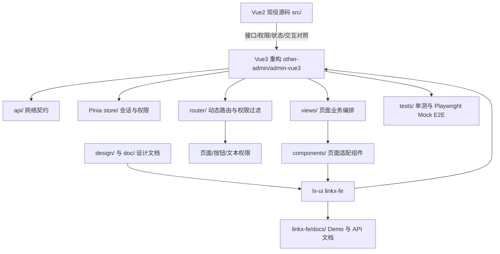

# LinkX 项目地图

## 2026-10-07 UI-13 / Wave 5 选择器组件验收

- **入口**：`linkx-fe/src/components/LxTreeSelect/`、`LxCascader/`、`LxSelectPagination/`；测试为 Vue3 `tests/unit/lx-select-pagination.test.ts` 及三份文档 E2E。
- **完成**：当前版本已覆盖键盘、清空、错误焦点、英文 locale、窄屏触控、表单禁用继承、迟到响应隔离、续页失败重试和禁用不请求；三份中文文档加入组件选型。
- **证据**：定向单测 36/36、文档 E2E 15/15、lx-ui typecheck/build/docs build、目标 ESLint/Prettier 和 `git diff --check` 通过。Impeccable A 32/40；B 9 个 detector 为有效 `[]`/空 stderr/exit 0，9 个独立浏览器 overlay 场景成功；代码复审无 P0–P2。
- **未关闭**：A 保留移动 Cascader 换行密度、Cascader 错误旧状态、Demo 主题入口和文档侧栏密度四项 P2；P3 长节点 E2E 覆盖增强。上述结果不增加 UI-10 52 项严格关闭数，也不代表 Vue3 页面已替换 Element Plus。
- **下一入口**：完成两笔白名单提交推送后，进入复杂组件批次（Upload 组合 abort 回归、Descriptions、VirtualTree、TransferPanel、MetricCard、SectionTitle、StatusSwitch、SearchBar），继续按组件库优先、宿主替换后置的顺序推进。

## 2026-10-07 UI-13 / DynamicForm、DatePicker 与 Upload 正式验收

- **入口**：schema 字段分发位于 `linkx-fe/src/components/LxDynamicForm/`，上传行为位于 `LxUpload/`，日期清空类型位于 `LxDatePicker/types.ts`；对应回归是 Vue3 `tests/unit/lx-dynamic-form.test.ts`、`lx-upload.test.ts`、`lx-date-picker.test.ts` 和三份文档 E2E。
- **修复**：Upload 模板根节点 ref 以运行时 DOM 守卫处理跨 Vue 类型边界；上传必填错误关联验证实际 `.el-upload[role="button"]`。`LxFormItem` 排除已卸载错误节点对应的内部 ID，并幂等恢复 ARIA 属性；新增同批次移除反馈/清校验回归。字段类型 E2E 逐类验证精确候选集合。
- **验证**：定向单测 **89/89**、三份文档 E2E 合并 **43/43**，最新 DatePicker/Upload 子集 **31/31**；Vue3 与 lx-ui 类型检查、目标 ESLint/Prettier、203 模块生产构建、文档构建和差异检查通过。文档构建保留既有大 chunk 警告。
- **E2E 配置**：4176 被另一项目占用并导致首次误测错误站点；lx-ui 文档测试已隔离到 4177，Switch 兼容用例另跑 6/6。4174 预览未受影响。
- **代码复审与状态边界**：独立复审未发现 P0–P2；短视口触发器与滚动断言的 P3 缺口已补。fallback UID 回灌后公开 `abort()` 的组合测试尚缺，列入后续 Upload 复验。Assessment A 为 30/40，B 六项目标 detector 均为有效 `[]`、stderr 空、退出码 0，10 个浏览器 overlay 场景已逐项归因；snapshot 已保存，trend 仅有首次 30/40 记录。实现提交为 `a2ba943`。真实上传服务端契约、`LxForm` 设计逐项对照和 UI-10 严格矩阵关闭数不包含在本次组件级验证中。
- **下一入口**：提交推送后进入 TreeSelect/Cascader 当前版本的键盘/触控与正式视觉复核，及 `LxSelectPagination` 表单禁用继承、迟到响应、续页失败同页重试与禁用不请求覆盖。

## 2026-10-06 UI-13 / Upload 跨实例 UID 复审修复

- **问题与入口**：独立代码复审确认 `linkx-fe/src/components/LxUpload/index.vue` 中回退 UID 前缀曾按组件实例重复计数，聚合多个上传字段时相同无 UID 文件可能重号；前缀生成现位于 `LxUpload/uid.ts` 模块级工厂。
- **回归入口**：`other-admin/admin-vue3/tests/unit/lx-upload.test.ts` 新增同一父组件两个 Upload 实例的相同文件回归；DatePicker、DynamicForm、Upload 单测合计 69/69 通过。
- **交付边界**：本次不修改业务 API、路由、权限、上传协议或 Vue3 页面；13 项文档 E2E 为修复前已通过结果，提交前需针对最终源码复跑。
- **评审状态**：先前 A/B 使用了不同源码冻结，且 B 浏览器只完成部分场景，不能作为正式 Critique。统一冻结后的新 A/B 尚待完成；详细记录见最新 `doc/PROJECT-HANDOFF.md` 与 `.impeccable/critique/wave4-dynamicform-2026-10-06/`。

## 2026-10-06 UI-13 / DynamicForm 与 Upload 当前交接

- **入口**：`linkx-fe/src/components/LxDynamicForm/` 按 schema 类型拆分字段渲染器；上传通用行为在 `linkx-fe/src/components/LxUpload/`；中文 API/Demo 位于 `linkx-fe/docs/components/lxdynamicform.md` 与 `lxupload.md`。
- **本轮边界**：修正受控上传重试时序、单/多文件值回映、URL/response/error 回灌和日期范围定位；Vue3 侧只增加组件级单测与文档 E2E，不改业务 API、路由、权限或页面，也未移除宿主 Element Plus。
- **验证**：DatePicker/DynamicForm/Upload 定向单测 69/69、fallback UID 修复后文档 Playwright 13/13；lx-ui 类型检查、目标 Prettier、Vue3 ESLint 通过。生产库构建和文档构建待本轮补跑。独立代码复审提出的 UID 问题已修复，修后复审与统一冻结后的正式 Impeccable A/B、snapshot/trend 尚待完成。
- **边界与下一步**：本轮组件集成验收不关闭 `LxForm`/`LxDynamicForm` 的完整设计图逐项差异记录，不增加 52 项 UI-10 严格矩阵关闭数，不代表 Vue3 业务页采用或真实上传协议联调。继续计划中的 TreeSelect/Cascader 当前版本正式复验，再按组件矩阵逐项完成库级门禁；Vue3 全量替换仍冻结。

## 2026-10-06 Wave 3 / LxIcon 当前交接

- **入口**：运行时组件 `linkx-fe/src/components/LxIcon/index.vue` 与 `icons.ts`；侧栏点位在 `linkx-fe/src/components/LxSidebar/`，上传状态图标在 `linkx-fe/src/components/LxUpload/index.vue`；中文目录为 `linkx-fe/docs/components/lxicons.md`。
- **回归关系**：`other-admin/admin-vue3/tests/unit/lx-icon.test.ts` 验证图标名称、别名、畸形/未知运行时输入和侧栏回退；`tests/e2e/lx-icon-docs.spec.ts` 验证文档搜索、复制、主题、键盘、移动触控和减少动效。
- **本轮闭环**：未知图标提供可访问回退；侧栏先解析图标键；目录具备语义搜索、清除回焦和权限节点业务样例；搜索栏不再遮挡滚动内容。
- **证据**：单测 7/7、当前 Playwright 配置 E2E 2/2（单 Chromium 项目，另有独立浏览器视图覆盖 375px）；Vue3/lx-ui 类型检查、目标 ESLint/Prettier、196 模块库构建、文档构建及 `git diff --check` 通过。修后 Assessment A 为 37/40；B 两个静态目标均为有效 `[]`/空 stderr/退出码 0，并完成五个浏览器 overlay 视图。正式报告和 snapshot 分别见 `.impeccable/critique/wave3-lxicon-2026-10-06/final-report.md` 与 `.impeccable/critique/2026-10-06T02-52-50Z__linkx-fe-docs-components-lxicons-md.md`。
- **边界与下一步**：展开 P1/P2 长分组仍保留 P2；真实读屏器播报、真实权限菜单异常数据和无 URL console 404 未覆盖/归因。不给 52 项矩阵增加关闭数。DynamicForm/Upload 后续组件级验收见本文件顶部；接下来按任务拆分进入 TreeSelect/Cascader 当前版本正式复验，Vue3 Element Plus 替换门槛不变。

## 2026-10-06 Wave 1 / LxPasswordInput 当前交接

- **入口**：组件与主题样式在 `linkx-fe/src/components/LxPasswordInput/`、`linkx-fe/docs/.vitepress/theme/custom.css`；中文 API/Demo 位于 `linkx-fe/docs/components/lxpasswordinput.md` 和组件 Demo；回归在 `other-admin/admin-vue3/tests/unit/lx-password-input.test.ts` 与 `tests/e2e/lx-password-input-docs.spec.ts`。
- **本轮闭环**：320px 真正的移动页内目录锚点避开导航；暗色站点主题延伸到 Demo 输入面；移动工具标签及高级标签为 44px。9 项浏览器 E2E 覆盖锚点、暗色/HUD、显隐、键盘、焦点、清空、只读/禁用和减少动效。
- **代码与视觉证据**：单测 10/10；A 32/40；B detector 目标 3/3 有效 `[]`、空 stderr、退出码 0；overlay 11 个节点归因为 HUD 主题规则和文档壳层。独立代码复审批准。完整资料见 `.impeccable/critique/wave1-lxpasswordinput-2026-10-05/final-recheck-2026-10-06/`。
- **待办与下一入口**：密码字段的宿主 Form 校验失败集成示例已加入 DynamicForm 组件级样例与测试；移动目录 32px 行高归共享文档壳层任务。动态图标和 DynamicForm/Upload 组件级验收状态见本文件顶部；严格 UI-10/UI-11 与 Vue3 Element Plus 替换门槛仍未关闭。

## 2026-10-05 Wave 2 / LxCheckbox 与 LxRadio 当前状态

- 入口：`linkx-fe/src/components/LxCheckbox/`、`LxCheckboxGroup/`、`LxRadio/`、`LxRadioGroup/`；中文 API/Demo 位于 `linkx-fe/docs/components/lxcheckbox.md` 与 `lxradio.md`，浏览器回归为 `other-admin/admin-vue3/tests/e2e/lx-checkbox-radio-docs.spec.ts`。
- 实现：复选组模型限定为字符串/数字值；浅色禁用文字与 HUD 次级文字按各自令牌呈现；Radio 实时状态使用中文选项名；Radio Demo 的已选禁用历史值置于组外，避免改变组内 Tab 停靠项。
- 验证：定向单测 20/20、文档 E2E 4/4、Vue3 类型检查、目标 ESLint/Prettier、lx-ui 类型检查/构建（196 modules）/文档构建通过；独立代码复审批准。实现/E2E 提交 `be86f10`。
- Impeccable：Assessment A 34/40；Assessment B 记录 16 个 Radio/RadioGroup overlay 状态并保留 Checkbox 状态证据，触屏实际命中高度 44px、无整页横向溢出。四个组件目录及最终 Radio Demo 的 detector 均为有效 `[]`、空 stderr、退出码 0。A 留下 375px API 表格阅读 P2，该项继续追踪；不宣称严格矩阵行关闭。
- 下一入口：`LxSwitch`；Vue3 宿主 Element Plus 替换仍等待 lx-ui 全库门禁。

## 2026-10-05 Wave 2 / LxSelect 当前状态

- 组件入口：`linkx-fe/src/components/LxSelect/index.vue`、`style.css`、`demo/basic.vue`；中文 API：`linkx-fe/docs/components/lxselect.md`；文档浏览器回归：`other-admin/admin-vue3/tests/e2e/lx-select-docs.spec.ts`。
- 设计依据：`design/表单控件八件套/code.html` 的 02 下拉样本与综合演练卡。桌面保留 32px 选项；窄屏/触屏选项和触发器为 44px。HUD 主色仅覆写在 teleported Select popper 上。
- 交互边界：远程检索数据仍由宿主注入；Demo 仅用本地 Mock。失败说明关联实际输入框，错误空态、弹层 footer 重试与恢复流程均有 E2E；单项离线禁用候选项按设计样本呈现。真实接口和业务宿主迁移未做。
- 验证：组件单测 10/10、当前文档 E2E 3/3、Vue3 类型检查、目标 ESLint/Prettier、lx-ui 类型检查、196 模块构建和文档构建通过。320px 主会话阶段检查六个触发器 44px，HUD popper 深色面与局部主色生效；阶段性测量与边界见 `.impeccable/critique/wave2-lx-select-2026-10-05/main-session-check.md`。
- 审查：Luna max 独立代码复审最终批准。Assessment A-only 暂定 29/40，运行态目标不可访问；Assessment B detector JSON `[]`/stderr 空/退出码 0 只表示静态零命中。正式 Impeccable 仍缺 overlay、当前版本持久截图和 snapshot/trend，不登记正式视觉通过；UI-10 严格矩阵行保持打开。
- 下一入口：Checkbox/Radio，之后 Switch；Vue3 页面 Element Plus 替换仍受组件库全量门禁约束。

## 2026-10-05 Wave 2 / LxDatePicker 最新状态

- 组件入口：`linkx-fe/src/components/LxDatePicker/index.vue`、`style.css`、`demo/basic.vue`；文档为 `linkx-fe/docs/components/lxdatepicker.md`。
- 弹层定位：窄屏按实际边界决定使用原生锚点或居中视口浮层；短屏弹层完整入屏，滚动限制在日历面板内，避免带动页面。
- 回归：DatePicker 文档 E2E 16/16、DatePicker/DynamicForm 定向单测 39/39；覆盖 320/375/390px、键盘、错误态、HUD、触控和减少动效。库类型检查、构建 196 modules、文档构建和 Vue3 目标 ESLint/Prettier 通过。
- 正式审查：Assessment A 31/40，Assessment B 9 个浏览器场景且静态 detector 为有效 `[]`；独立代码审查批准。证据见 `.impeccable/critique/wave2-date-range-2026-10-05/final-review/`，综合快照为 `.impeccable/critique/2026-10-04T21-53-59Z__linkx-fe-src-components-lxdatepicker-index-vue.md`。
- 未关闭项：字段上下文遮挡、快捷日历末行需滚动且缺提示、桌面标签重叠、浮层贴近底边仍待跟踪；因此 DatePicker 不登记为 UI-10 严格矩阵已关闭。320px 文档横向滚动尚不能归因于组件。
- 下一入口为 `LxSelect`，继而 Checkbox/Radio 与 Switch；本组件子项验收不代表 UI-10 52 项或 lx-ui 全库门槛完成。

## 2026-10-05 Wave 2 / LxDatePicker 当前入口

- Demo 与样式入口：`linkx-fe/src/components/LxDatePicker/demo/basic.vue`、`style.css`；公开组件与字段说明适配仍见 `LxDatePicker/index.vue` 和 Wave 0 交接。本波将区间示例前移、低频说明折叠，并修正 HUD 分隔符对比度和小屏弹层宽度。
- 关联浏览器回归：`other-admin/admin-vue3/tests/e2e/lx-date-picker-docs.spec.ts`。12/12 用例通过，覆盖区间首屏、320/375/390px 弹层边界和触控、HUD 对比度、键盘/Escape、减少动效。
- 小屏边界证据：快捷区间弹层底部在初始滚动位置超出 54px；滚动页面后最后一行完整显示并能成功选择，焦点稳定。详见 `.impeccable/critique/wave2-date-range-2026-10-04/` 当前版本 Assessment A/B 与综合报告。
- 当前仍是 Wave 2 的一个子项；`LxSelect`、Checkbox/Radio 和 Switch 仍待逐项严格对照及审查。宿主页面替换需等 lx-ui 全库门禁。

## 2026-10-04 后续任务拆分入口

跨组件库、Vue3 迁移、权限、Mock、登录页和动态图标的完整后续任务按 Wave 0–12 拆分，见 [`PROJECT-FOLLOWUP-BREAKDOWN.md`](./PROJECT-FOLLOWUP-BREAKDOWN.md)。`LxPasswordInput` 的透传 `type` 遮罩覆盖问题已由提交 `2762816` 修复并通过 7/7 定向单测；独立代码复审批准，未发现 P0–P2。Assessment A 最新静态复评为暂定 30/40，已检查修复后的源码和文档，但视觉判断仍依赖旧截图；Assessment B 六个 detector 均为有效 `[]`、空 stderr、退出码 0，只表示静态零命中。当前浏览器策略阻止 overlay 注入，Wave 1 正式 Impeccable Critique 仍待补；继续 Wave 2 实现与行为检查，宿主 Element Plus 删除仍受全库门禁约束。

## 2026-10-03 UI-13 DynamicForm 字段反馈复验

- `linkx-fe/src/components/LxDatePicker/index.vue` 将描述 ID 同步到实际输入框；描述变更/清空及相邻日期字段隔离由 Vue3 定向单测覆盖。
- `LxDynamicForm` 字段反馈按实例生成唯一 ID，加载态禁用重试，上传和自定义 slot 可关联字段说明。Demo 可固定查看候选项 loading；中文 API 文档补最小 schema 和长表单宿主分区边界。
- DynamicForm/DatePicker 单测 34/34、文档 Playwright 1/1、类型检查、库构建、文档构建和目标静态检查通过。Assessment A 为 29/40（Good）；Assessment B detector `[]`、空 stderr、退出码 0 只表示静态零命中。浏览器注入能力不可用，当前 Impeccable 评审未正式闭环。
- 文档侧栏数据录入分组的同级入口数量作为全站导航信息架构待办；本轮不登记正式 UI-13/UI-11 关闭。实现入口、API、设计审核与迁移清单分别见 `linkx-fe/src/components/LxDynamicForm/`、`linkx-fe/docs/components/lxdynamicform.md`、`doc/lx-ui/COMPONENT-AUDIT.md`。

## 2026-10-03 UI-10 Wave 6 交付与审查状态

- `linkx-fe/src/components/LxTreeSelect/` 与 `LxCascader/` 的实现及文档交互 Demo 已完成；单测 17/17、文档 E2E 8/8（`playwright.lxui.config.ts`，VitePress 4176）。Cascader 可从 `/components/lxcascader.html` 和 `/components/new-components.html` 查看。
- 当前两组件源码和两份文档的 detector 均为有效 JSON `[]`、stderr 空、退出码 0，仅表示静态零命中。10 月 2 日 overlay 早于当前代码/文档修改；本次浏览器策略拒绝 overlay 注入预检，故当前正式 Impeccable Critique 未完成，TreeSelect/Cascader 不登记为严格 UI-10 已关闭。
- 下一入口是 `design/按钮体系/`、`design/表单控件八件套/` 对应的 `LxButton`、`LxInput`、`LxTextarea`、`LxSelect`、`LxDatePicker`、Checkbox/Radio、Switch、PasswordInput；`LxInputNumber` 的实现回归已具备，随基础控件批次统一正式审查。

## 2026-10-02 UI-10 Wave 6 TreeSelect/Cascader 修后复验中

- 树/级联组件入口：`linkx-fe/src/components/LxTreeSelect/` 与 `linkx-fe/src/components/LxCascader/`；中文 API 位于 `linkx-fe/docs/components/lxtreeselect.md`、`lxcascader.md`，宿主行为测试位于 Vue3 `tests/unit/lx-tree-select.test.ts`、`lx-cascader.test.ts`，文档 E2E 对应 `tests/e2e/lx-tree-select-docs.spec.ts`、`lx-cascader-docs.spec.ts`。
- TreeSelect 多选 footer 遵从 locale 且支持自定义文案；Cascader 在 `loading && error` 时由 loading 主导，结束后再呈现错误/重试；Demo 将选择模式和状态控件分组，级联值展示不再作为第二个 live region 重复播报。
- 修后单测 17/17 与文档浏览器 E2E 5/5 通过；lx-ui typecheck/build/docs build 与 Vue3 vue-tsc、Prettier 通过。Vue3 ESLint 忽略外部库路径；linkx-fe 无独立 ESLint 配置，因此不登记为 lint 通过。
- Impeccable 修后 A/B 仍在执行。前置 overlay/screenshot 和 detector 记录位于 `.impeccable/critique/wave6-current-2026-10-02/`；四个 detector 的 `[]` 仅代表静态零命中，不能作为视觉审查结论。

## 2026-10-02 预览回归与文章分页

- `LxInputNumber` 使用 `controls` 参数控制步进按钮，默认显示，`:controls="false"` 隐藏；实现、API、Demo、单测与浏览器用例相符。
- `other-admin/admin-vue3/src/views/h5/carousel/components/CarouselForm.vue` 的文章分页现在防止并发重复加载、重复 ID 和切换公众号后的迟到响应；Mock E2E 验证页码 1、2 及第 21 篇唯一呈现。
- `tests/e2e/preview.spec.ts` 的菜单验收通过 `aria-controls` 关联真实下拉滚动容器；完整本地预览回归 6/6。该证据不替代真实后端联调或各页面深层迁移验收。

## 2026-09-30 基础组件审查范围扩展

基础组件审查不只覆盖表单容器：`LxButton`、`LxInput`、`LxInputNumber`、`LxTextarea`、`LxSelect`、`LxDatePicker`、Checkbox/Radio 组、`LxSwitch`、`LxPasswordInput` 均必须与 `design/表单控件八件套/` 和 `design/按钮体系/` 逐项对照。后续入口为各组件的 Demo/API、行为测试、桌面/375px/HUD/减少动效浏览器证据及独立 Impeccable A/B；组件库闭环前不进入 Vue3 Element Plus 批量替换。

## 2026-09-30 UI-10 Wave 5 postfix 证据

- 五个反馈/浮层组件的最新入口仍为 `linkx-fe/src/components/LxDialog/`、`LxDrawer/`、`LxEmpty/`、`LxPageCard/` 和 `LxFormErrorBanner/`；portal 浮层通过根级 HUD 令牌保持主题一致，业务请求仍由宿主负责。
- 最新 A/B 证据位于 `.impeccable/critique/wave5-postfix-2026-09-30/`：A 为 34/40；B 覆盖亮色/HUD、桌面/375px、Escape、错误恢复和 API 表滚动，保存 16 张截图及 sidecar，外部请求 0。B 因 CUA 不可用使用 Playwright fallback，状态为降级证据。
- 当前可继续复用的行为契约：Dialog/Drawer 44px 关闭热区和键盘退出、Dialog 首错字段聚焦、PageCard 错误到 loading 再恢复数据、文档 API 表只在自身容器横向滚动。UI-11 全库矩阵仍未关闭。

## 2026-09-30 UI-10 Wave 5 组件入口与证据

- Wave 5 组件入口为 `linkx-fe/src/components/LxDialog/`、`LxDrawer/`、`LxEmpty/`、`LxPageCard/` 和 `LxFormErrorBanner/`；页面编排仍由宿主负责，组件库不发起业务请求。
- 每个入口已同步 Demo、中文 API 文档、公开类型/事件和 Vue3 宿主回归：定向单测 17/17、文档 Playwright 7/7，库 typecheck/build/docs build 通过。
- 浏览器证据目录为 `.impeccable/critique/wave5-2026-09-30/`；静态 detector JSON `[]`、stderr 空、退出码 0，浏览器结果通过且无外部请求。Drawer 移动端截图已等待过渡结束，375px 下 `x=0,width=375,height=812`、页面 `scrollWidth=375`。
- UI-11 正式双路 Critique 尚在收口，不能把 `[]` 或阶段性截图单独标记为正式通过。`LxForm/demo/control-bridge.vue` 直接使用 `ElTabs`/`ElTabPane` 的桥接缺口已登记，后续按 UI-10 规则处理。

## 2026-09-30 表单组件入口变更

- `linkx-fe/src/components/LxForm/` 与 `LxDynamicForm/` 是本波表单实现入口；DynamicForm 由 schema `type` 分发至 `fields/` 子组件，字段仅组合公开 `Lx*` 控件，上传适配器由宿主注入。
- `LxDynamicForm` 同时保留 `v-model` 和受控 `value`/`change(nextValue)`，支持单/多文件列表，默认按容器宽度布局为 3/2/1 列；Element Plus 仅作为 Lx 封装内部行为内核。
- `LxDynamicFormField.feedback` 可将远程/宿主状态贴近字段显示并提供可选 `retry()`；请求仍由宿主按 Promise 链编排，避免失败文案脱离字段或在 footer 重复。
- 基础控件和表单回归位于 `other-admin/admin-vue3/tests/unit/lx-dynamic-form.test.ts`、`tests/e2e/lx-form-docs.spec.ts` 与 `tests/e2e/lx-dynamic-form-docs.spec.ts`；业务 API 仍由宿主注入并遵守 Promise 链风格。

## 2026-09-30 续接增量

- 用户确认的执行顺序：先完成 `LxForm`/`LxDynamicForm` 的设计稿严格对照，再对 `componentRegistry` 的 52 个公开 Lx 组件逐项核对并闭环，完成库级 Impeccable 复验后，才开始 Vue3 Element Plus 全量替换；替换后另做整站审查。完整逐项台账见 `doc/lx-ui/COMPONENT-AUDIT.md`。
- 提交 `2a93ef1` 已加入多组公开 Lx 基础控件、样式、Demo 和测试；业务组合使用 `Lx*`，封装内部允许 Element Plus 行为内核。AuthImg 后续 P1/P2 与 DESIGN §8.6 Mock E2E 按上述顺序排在 lx-ui 完整验收之后，不再抢在 UI-13 前执行。

## 2026-09-29 交付增量

- GLM #8：License 刷新失败或响应数据无效时保留现有 Pinia/localStorage 授权；有效成功响应才写入。回归、评审与后续项见 `other-admin/admin-vue3/docs/CODE-REVIEW-VALIDATION.md`。
- GLM #10/#11：原计划范围内第三方应用及专用管理员用户页的删除/启停锁已覆盖确认/请求并在 `.finally()` 释放；ColForm 人员搜索增加 AbortSignal、请求代次保护及保留关键词的触底分页。重复提交页和 ColForm 竞态 Mock E2E 分别 5/5 与 4/4 通过。GLM #9/#10 降级 Critique 已由独立 Luna `max` A/B 重做并保存正式快照；跨到 `/authority/adminRole` 与 `/authority/adminPerson` 后发现的额外写操作锁缺口列为 CODE-03，详见交付计划和代码评审台账。
- GLM #1：`linkx-fe/src/index.ts` 以显式名称注册 39 个 lx-ui 组件，插件安装回归 1/1；类型、库构建、文档构建和 Vue3 全量单测通过。代码审核未发现新增问题；组件库无 ESLint CLI，未记录为通过。GLM #2 Cascader 已按 Element Plus 契约保留 string/number/record object 原值，含普通 `call` 和 `Symbol.iterator` 字段的记录回归通过；类型、库构建、文档构建、6 项行为单测和 ColForm 竞态 E2E 4/4 通过，证据见交接及评审台账。
- CODE-02：`useFetch`/`useTable` 取消与竞态回归 9 项通过；`v-loadmore` 依据 `aria-controls` 绑定 teleport 列表，并清理 observer/滚动监听。指令单测 3/3，轮播文章真实 Element Plus 下拉分页 Mock E2E 1/1；完整证据见 `other-admin/admin-vue3/docs/CODE-REVIEW-VALIDATION.md`。
- Impeccable：detector 的 `[]` 每次都触发证据核验；即使 JSON 有效、stderr 为空、退出码为 0，也只表明目标源码静态规则零命中，不能单独代表浏览器/视觉复验通过。

## 2026-09-28 交付增量

- Element Bridge 当前选择器规则：单选/多选均使用自身 1px `border-box` 实体边框，状态仅切换边框色，不使用选择器 `box-shadow`/`outline`；最终 Impeccable A/B snapshot 为 30/40。Detector `[]` 只代表静态规则零命中，必须和浏览器状态、overlay 截图、stderr、退出码及 snapshot 一起才能记为复验完成。
- CODE-02 请求基础层：`other-admin/admin-vue3/src/composables/useFetch.ts` 提供可选 AbortSignal、取消失效序号、卸载保护和可取消调度；`useTable.ts` 在序号校验后的 `onSuccess` 提交列表/总数。测试台账见 `other-admin/admin-vue3/docs/CODE-REVIEW-VALIDATION.md`。

本文是项目定位入口。新增模块、路由、公共组件或 API 后，先更新本文件，再补实现和测试证据。

## 组件库执行点

组件与图标迁移严格按顺序执行：`design/` 基础控件与动态图标 → 按 UI-13 重做 `LxDynamicForm` → 其他 lx-ui 组件及 Impeccable 组件/动效审查 → Vue3 Element Plus 替换；全量替换后再审查整站。基础控件桥接、动态图标和 `LxDynamicForm` 旧版已有库级证据，但 DynamicForm 已因用户新需求重新排期，旧证据只作回归基线；当前继续闭环实际宿主候选。`LxSectionTitle` 已完成 size/tag/tagType 设计映射、独立 API/Demo、13 项单测和 320/375px 文档浏览器验收；配置页真实组合回归仍待 UI-04。`LxIcon` 已按 Impeccable 预检建议采用自然减速曲线，`LxUpload` 进度已使用 transform 并尊重减少动效。`LxMetricCard` 已对照设计稿补齐独立中文 API/Demo、语义色、LxIcon 趋势箭头、进度可访问性，并兼容旧宿主 props/slots；Vue3 详情抽屉 6 处仍待后续替换回归。`LxAuthImg` 已补独立 API/Demo、Blob 请求注入、取消竞态与对象 URL 回收证据；Vue3 鉴权适配器仍待后续替换波次。组件证据、接入位置与状态见 `doc/PROJECT-DELIVERY-PLAN.md`、`linkx-fe/docs/ROADMAP.md` 和 `other-admin/admin-vue3/docs/ELEMENT-PLUS-LX-UI-MATRIX.md`。

`LxEmpty` 已按 lx-ui 空态规格补齐默认/紧凑尺寸、`imageSize` 兼容和 `default`/`footer` 插槽；阶段性启发式评审曾记录 28/40 与 34/40，浏览器 overlay 的 8 条发现中 5 条确认是低对比度文本，已改用正文令牌并补筛选恢复、双主题对比度浏览器断言。后续流程核验发现这些评分没有正式 Impeccable Critique 快照，设计评审也未在独立新标签检查页面，因此只作为阶段性证据，UI-11 正式审查仍待按 skill 规范完成。源码 CLI `detect.mjs` 返回 `[]` 只代表目标源码静态规则零命中；URL CLI 还必须核对 stderr 和退出码，Puppeteer 缺失时即使 stdout 为 `[]` 也属于扫描失败。Vue3 的 15 处 `el-empty` 仍待 UI-04 替换。

`LxIcon` 上次正式 Critique 为 27/40；本轮隔离 Assessment A 修前基线为 32/40，Assessment B 完成六项 detector 三件套和九个浏览器 overlay 视图。图标页现已处理暗色主题文字、长目录检索、英文键字号、空态对比度与 P1 别名计数；修后 E2E 2/2，吸顶、主题对比和焦点恢复通过。A 评分未在修改后重算；完整证据、overlay 归因和当前交接见 `.impeccable/critique/wave3-lxicon-2026-10-06/`。未覆盖真实读屏器播报与权限菜单数据回退；整库 UI-11 仍待剩余组件闭环。

`LxForm` 桌面多列网格按设计稿采用 16px 列距并保留 `span`，视口宽度不大于 640px 时自动折为单列，字段（含通栏项）占满宽度。输入框、数字、日期和文本域焦点使用控件内 1px 状态边线加紧邻的 2px、15% 主题主色光晕；单选与多选下拉统一只切换控件自身 1px `border-box` 实体边框颜色，错误焦点保留错误色边框，不加外圈；焦点不改变尺寸。复选框零间隙外圈不改变尺寸，HUD 未选框使用暗底和高对比边线，Demo 的全选项与子项分行缩进。定向 Playwright 覆盖键盘展开、两类选择器错误态、复选框三态、主题、组间距、尺寸稳定和窄屏；本轮多选单边线修复与 Impeccable 复核结果见交接，错误提示文字约 4.4:1、移动弹层遮挡字段标签和选项行高为后续待办。Vue3 宿主表单替换及其业务校验契约仍在 UI-04 跟踪。

## 目录职责

| 目标               | 位置                                                                                  | 先查什么                                                                                                                                                                                                                                                                                                                                                                                                                                                                                                                                                                                                                                                                                                                                                                                                                                                                                                      |
| ------------------ | ------------------------------------------------------------------------------------- | ------------------------------------------------------------------------------------------------------------------------------------------------------------------------------------------------------------------------------------------------------------------------------------------------------------------------------------------------------------------------------------------------------------------------------------------------------------------------------------------------------------------------------------------------------------------------------------------------------------------------------------------------------------------------------------------------------------------------------------------------------------------------------------------------------------------------------------------------------------------------------------------------------------- |
| 页面行为迁移       | `src/views`、`other-admin/admin-vue3/src/views`                                       | Vue2 同名页面、路由入口、权限键、API                                                                                                                                                                                                                                                                                                                                                                                                                                                                                                                                                                                                                                                                                                                                                                                                                                                                          |
| 网络协议           | `other-admin/admin-vue3/src/api`                                                      | Vue2 API 文件、请求方法、字段和状态值                                                                                                                                                                                                                                                                                                                                                                                                                                                                                                                                                                                                                                                                                                                                                                                                                                                                         |
| 登录与账号隔离     | `other-admin/admin-vue3/src/views/login`、`src/utils`、`store/modules`、`router`      | OAuth、记住账号名、改密/License 流程；登录设计参考见 `doc/登录1/`、`doc/登录2/`，落地见交付计划 UI-05                                                                                                                                                                                                                                                                                                                                                                                                                                                                                                                                                                                                                                                                                                                                                                                                         |
| 页面/按钮/文本权限 | `src/router/filterChain.ts`、`src/composables/usePermission.ts`、`src/directives`     | 菜单 URL、`permissions.menus`、`permissions.actions`、管理员例外                                                                                                                                                                                                                                                                                                                                                                                                                                                                                                                                                                                                                                                                                                                                                                                                                                              |
| 复用逻辑           | `src/utils`、`src/composables`                                                        | 是否有响应式/生命周期副作用，再决定放置位置；`useFetch`、`useTable` 请求规则见 CODE-01 与根 `AGENTS.md`                                                                                                                                                                                                                                                                                                                                                                                                                                                                                                                                                                                                                                                                                                                                                                                                       |
| 通用 UI 与图标     | `linkx-fe/src/components`、`linkx-fe/src/components/LxIcon`、`design/`、`doc/LxIcon*` | 优先复用 lx-ui；94 个标准图形提供 96 个名称；P0/P1/29 枚共 69 个去重动效名称已有单测和桌面/触屏浏览器证据。基础控件桥接页已覆盖按钮、表单八件套、Tabs、Card、Tree、Descriptions，并完成桌面、HUD 深色和 375px 检查；`LxDynamicForm` 已完成独立 Demo/API、Mock 成功/空/错、联动、禁用、重置、栅格和 375px 检查，`daterange` 默认清空值为 `null`；`LxStatusSwitch` 已完成独立 API/Demo、6 项单测和 3 项文档 Playwright，覆盖确认/取消、旧值映射、只读、失败恢复、对比度、焦点、44×44px 窄屏点按区和减少动效；`LxSelectPagination` 已补设计稿要求的 targetMap 回显、300ms 防抖、取消旧请求、标签折叠及 3 项文档 Playwright。Vue3 首批已接入侧栏、Navbar、SearchBar、GroupTags 图标及 SectionTitle 适配器；StatusSwitch 等候选尚待宿主替换，矩阵见 `other-admin/admin-vue3/docs/ELEMENT-PLUS-LX-UI-MATRIX.md`。组件库完成后做 Impeccable 组件/动效审查，宿主完成后做全站审查；Vue2 页面迁入 Vue3 时直接采用 lx-ui |
| 组件示例           | `linkx-fe/docs/components`                                                            | Props、事件、插槽、暴露方法及状态演示                                                                                                                                                                                                                                                                                                                                                                                                                                                                                                                                                                                                                                                                                                                                                                                                                                                                         |
| 迁移证据           | `other-admin/admin-vue3/docs`、`tests`                                                | 台账状态和对应测试，不以源码存在推断完成                                                                                                                                                                                                                                                                                                                                                                                                                                                                                                                                                                                                                                                                                                                                                                                                                                                                      |

lx-ui 当前执行顺序固定为 `design/` 基础控件与动态图标 → `LxDynamicForm` → 其他宿主候选组件、完整库级验收和 Impeccable 审查 → Vue3 Element Plus 组件替换。前两项库级浏览器验收已完成；SearchBar 已补 3 项行为测试及成功/空/错、失败恢复和 375px 全字段浏览器证据；Dialog 已补 4 项行为测试和 3 项文档 Playwright；ProTable 已补跨页选择修复、加载/减少动效、空错恢复、排序、375px 方向键滚动/44px 点按及 HUD 主题 4 项文档 Playwright；SelectPagination 已补 3 项文档 Playwright，覆盖跨页回显、取消、错误恢复和 375px 触屏；Upload 已补 4 项单测、3 项文档 Playwright；Descriptions 已补 6 项单测、3 项文档 Playwright，并完成组件级 Impeccable 定向检查；StatusSwitch 已补 6 项单测、3 项文档 Playwright；AuthImg 已补 6 项单测、3 项文档 Playwright，覆盖 Blob Mock、取消竞态、资源清理、失败回退和 375px/HUD/减少动效；LxSidebar 键盘分组/rail 焦点、移动模态抽屉和减少动效文档 E2E 2/2 通过。整库 Impeccable 审查尚未完成，Vue3 批量替换仍须等待 UI-10/UI-11 门槛。详细状态见 `linkx-fe/docs/ROADMAP.md` 和 `other-admin/admin-vue3/docs/MIGRATION-BACKLOG.md`。

`LxActionButtons` 已补 disabled 原生语义、键盘可操作的溢出项、Escape 焦点恢复和 375px 浏览器验收（3 项单测、3 项 Playwright，含 44×44px 点按与焦点/外部点击收起）。Vue3 29 处宿主 `ActionButtons` 尚未替换，适配契约见 `ELEMENT-PLUS-LX-UI-MATRIX.md`；本步仍在组件库阶段，不改变既定 Impeccable 和替换门槛。

`LxSplitLayout` 已补独立中文 API/Demo、3 项宿主单测和 3 项文档 Playwright；修复折叠时主区换行，并验证桌面拖动/键盘限宽、375px 纵向布局、表格局部滚动、HUD 深色与减少动效。宿主业务页面仍未采用该组件；UI-11 整库 Impeccable Critique 仍待 UI-10 完成，detector `[]` 不作为审查通过。

Vue3 鉴权图片链路：`src/api/authImage.ts` 按 Vue2 网关映射请求站内相对图片、在 Authorization 请求头携带 Token 并支持 AbortSignal；`src/components/AuthImg/index.vue` 负责失败重试、请求归属保护及 Blob URL 生命周期。轮播图、头像、设备/协同/应用图标的 10 个宿主调用均提供 `alt`。验证见 `tests/unit/auth-img.test.ts`、`tests/unit/auth-image-api.test.ts` 和 `tests/e2e/preview.spec.ts`；UI-04 尚需替换为 lx-ui 组件并真实后端联调，正式 Impeccable Critique 因评审服务/页面注入限制未通过。

`LxDutyCalendar` 已补独立中文 API/Demo、8 项单测和 3 项文档 Playwright，验证 42 格网格、日期键盘导航、跨月焦点、插槽、空/加载/失败/只读宿主状态、375/320px、HUD 深色和减少动效。它是通用展示组件，未发现专属 `design/` 日历稿；Vue3 排班页现有 `DutyCalendar.vue` 仍依赖班次详情 popover、loading、月份查询事件和实例方法，UI-04 需要保留旧契约的适配层，不能直接替换。UI-11 正式审查仍待 UI-10 其余候选闭环。

`LxPagination` 有独立中文 API/Demo、5 项库单测、2 项 Vue3 适配器单测和文档 Playwright 3/3，覆盖受控事件顺序、`autoReset`/`autoScroll`、旧 `page/limit/pagination` 契约、自定义 layout、背景、简体中文 locale、主题和 375px 键盘局部滚动。Vue3 仍有 4 处页面直接使用 `el-pagination`；本轮 detector `[]` 只表示静态规则零命中，正式 UI-11 Critique 尚待 UI-10 闭环。

`LxPasswordInput` 已补独立中文 API、状态 Demo 和文档浏览器验收；本次回归补测确认调用方传入 `type="text"` 仍由组件显隐状态控制。剪贴板默认允许，显式事件拦截仅是前端交互策略，不构成安全控制。Vue3 密码适配器测试与组件测试分开记录；真实登录/改密认证联调不由组件 Demo 代替。

`LxBreadcrumb`、`LxNavbar`、`LxTabsBar`、`LxPageCard` 壳层 Demo 的 Playwright 4/4 通过，覆盖键盘路由接管、通知/用户菜单、页签切换与关闭、卡片加载和具名 region。复验修复了徽标遮挡通知按钮，并将窄屏溢出断言限制在组件容器；VitePress 文档整页宽度会受代码表格影响。该验证属于 UI-10 组件行为证据，不代表 UI-11 正式 Critique 或 Vue3 业务宿主回归完成。

## 模块定位表

| 业务入口                                                    | Vue3 页面                                                                                         | 重点 API/组件                                                                                                                                 | 验证位置                                                                                                                                                                                                            |
| ----------------------------------------------------------- | ------------------------------------------------------------------------------------------------- | --------------------------------------------------------------------------------------------------------------------------------------------- | ------------------------------------------------------------------------------------------------------------------------------------------------------------------------------------------------------------------- |
| `/authority/*`                                              | `src/views/authority`                                                                             | `auth/components/EditRole.vue` 与 `userManage/EditUser.vue` 的菜单/数据树加载保护；人员角色按钮和身份例外                                     | 权限矩阵 14 项、IM 绑定工作流 3 项通过；默认业务 E2E 86/86；IM 权限配置、人员设角和真实联调待补                                                                                                                     |
| `/baseData/*`                                               | `src/views/baseData`                                                                              | 全局配置、地图、布局和第三方配置；全局参数权限、地图/区划文件、App H5 板块 CRUD、协同配置 ID 回填、PC 页签写回和统计 Excel 下载均有 Mock 覆盖 | `tests/e2e/base-data-workflow.spec.ts`：33/33 通过；真实后端联调未执行                                                                                                                                              |
| `/nodeManage/*`                                             | `src/views/nodeManage`                                                                            | 节点、服务器、客户端拒绝、状态点                                                                                                              | `ui-audit.spec.ts`、节点 API 测试                                                                                                                                                                                   |
| `/thirdParty/*`                                             | `src/views/thirdInterface`、`src/views/eventType/thirdParty`                                      | 智能体、南向、通信、警单及北向接入                                                                                                            | `thirdParty.ts`；北向列表/筛选/详情/增改删在 `eventType/thirdParty/index.vue`，契约与 Mock 证据见迁移矩阵                                                                                                           |
| `/policeExtend/*`                                           | `src/views/policeExtend/virtualUser`、`src/views/h5/archivedTable`                                | 虚拟用户、已归档群组；归档菜单路径沿用 Vue2 `/policeExtend/ArchivedTable`，旧 `/h5/ArchivedTable` 重定向兼容                                  | `router/modules/policeExtend.ts`、`router/index.ts`、`mock/preview-menu.ts`、`tests/e2e/preview.spec.ts`                                                                                                            |
| `/h5/*`、`/collaboration/*`、`/location/*`、`/scheduling/*` | 对应 `src/views`                                                                                  | 查询、导入导出、上传、排班和位置                                                                                                              | 排班 `shift-scheduling-workflow.spec.ts`：4/4；协同下岗 `collaboration-workflow.spec.ts`：1/1 Mock E2E；组织树/记录导出/位置和真实联调见 `MIGRATION-BACKLOG.md`                                                     |
| OAuth/`/h5/GroupTags`                                       | `src/views/h5/groupTags`                                                                          | 群组标签分页、详情、增改删、批量删除、旧图标值到 lx-ui `LxIcon` 的渲染映射和颜色表单；窄屏表格/分页独立滚动                                   | `src/api/h5/groupTags.ts`、`src/views/h5/groupTags/iconMap.ts`、`tests/unit/group-tags.test.ts`、`tests/e2e/group-tags.spec.ts`；本地 Mock 预览在 `mock/preview-server.ts`，完整权限和真实联调待补                  |
| 本地 Mock 预览                                              | `other-admin/admin-vue3/mock/preview-server.ts`、`preview-menu.ts`、`preview-data.ts`、`dev:mock` | 登录、静态首页 + 10 组/32 个动态入口，共 33 个首屏样例；侧栏搜索和“全部菜单”目录；轮播图本地 SVG；未知接口返回 501，不启用后端代理            | `http://127.0.0.1:30847/h5/GroupTags`（本轮确认服务运行）；`tests/e2e/preview.spec.ts` 2/2；全菜单截图 `other-admin/admin-vue3/test-results/mock-preview-all-menus.png`；范围见交付计划 DEV-01/DEV-03/DEV-05/DEV-06 |

## 问题定位路径

1. 先确认入口和权限：路由模块、菜单响应、权限键、账号类型。
2. 再确认协议：Vue2 API 与 Vue3 `src/api` 的 URL、方法、请求体、响应字段和状态值。
3. 再确认状态边界：loading、空结果、失败恢复、取消、重复提交、分页和跨页选择。
4. 最后确认展示层：业务适配组件、lx-ui 组件 API、主题令牌和可访问性。
5. 将修复补到最接近的单测或 Mock E2E，并更新台账；不要在页面内复制已有 util/composable。

## 交付治理文档

| 文档                           | 用途                                                  |
| ------------------------------ | ----------------------------------------------------- |
| `doc/PROJECT-DELIVERY-PLAN.md` | 迁移、权限、lx-ui、设计、架构和验证任务的唯一交付计划 |
| `doc/PROJECT-HANDOFF.md`       | 每个步骤的改动、验证、阻塞和下一步交接记录            |

当前质量门禁：默认业务 Playwright 最近记录 86/86、全菜单 Mock 预览 2026-09-28 复验 2/2、定向权限矩阵最近 14/14、IM 绑定工作流 3/3、基础数据工作流最新 33/33 通过。该预览套件首次冷启动时导航曾超时一次，Chromium 手动复现及完整重跑通过，根因未确认；旧北向 Mock 隔离差异由本次套件复验覆盖。Vue3 Vitest 最近 34 个文件、173 项通过；LxIcon 文档浏览器验收走独立配置，桌面 Chrome 和 Pixel 7 各 1 项通过。`pnpm build` 通过，仍有 Less 变量导出、分包循环、动态/静态导入和大 chunk 等警告，详见交付计划 P0-06。

## 复用规则

- Vue3 宿主业务 API 调用按 `AGENTS.md` 使用 `.then().catch().finally()`；历史代码按交付计划 CODE-01 分模块收敛。弹窗、表单校验等非 API 异步流程不作机械转换。
- 用户于 2026-09-26 确认：Vue2 已有菜单、按钮权限码和管理员例外属于迁移基线；超出旧版的细粒度权限扩展、文本/字段权限、新权限中心工作流及页面引导系统延期，恢复条件见交付计划和权限契约清单。
- 已收敛模块：基础数据、登录/登出、会话心跳、权限与 License 初始化、Navbar 绑定人员读取及同步进度工具、权限中心菜单/角色/人员/数据树/自定义部门请求、协同岗查询与写入请求、第三方接口统一通信/智能体/南向/应用/警单/北向请求、排班、全部 H5 页面、位置、仪表盘、虚拟用户，以及组织树/绑定弹窗/远程分页选择/ProTable API；`useTable`、`useFetch`、菜单与 License 路由初始化、HTTP 401 会话结束及登出流程均已按 Promise 链收敛。全源静态扫描无直接业务 API `await`，本地异步交互保留原写法；401 原请求错误透传和提示门恢复由 `auth-http.test.ts` 回归。
- 无响应式副作用的格式化、校验、映射和协议解析放 `src/utils`。
- 有响应式状态或生命周期的逻辑放 `src/composables`，并提供清理机制。
- lx-ui 不依赖业务 API、Router、Pinia 或登录凭据；请求由宿主通过 props、事件或 adapter 注入。
- 业务适配层保留旧 props、事件、插槽、分页、取消和选择语义；外观统一不能改变提交时机。
- Vue2 页面迁入 Vue3 时优先复用 lx-ui；Vue2 runtime 不能直接导入 Vue3 组件库，跨版本复用需独立兼容层和验证。

## Vue3 UI 依赖边界

Element Plus 与 lx-ui 的依赖关系、46 种模板标签映射、缺少专用 Lx 封装的控件，以及移除宿主直接依赖的门槛见 [ELEMENT-PLUS-LX-UI-MATRIX.md](../other-admin/admin-vue3/docs/ELEMENT-PLUS-LX-UI-MATRIX.md)。该项已完成盘点，Vue3 源码和 Vite 配置尚未切换，宿主直接依赖目前不能删除。

执行顺序已调整为：先完成将由 Vue3 采用的高频 lx-ui 组件契约、Demo、行为测试和浏览器检查；再统一宿主导入、类型、自动导入、插件、样式与分包；随后按共享组件影响面分批替换页面，并在每批后回归受影响业务；全部迁移后才删除 Vue3 宿主的 element-plus 直接依赖。业务 API、字段、状态和 Vue2 已有菜单/按钮权限契约继续按源代码核对，不依赖该替换顺序。新权限中心、文本/字段权限及页面引导延期。`LxVirtualTree` 独立中文 API/Demo、8 项行为单测、桌面方向键交互及 375px HUD 深色检查通过；`LxTransferPanel` 独立 API/Demo、4 项单测与 3 项文档浏览器用例覆盖全选/反选、树外键与禁用键保留、上限、清空和窄屏触控。二者均尚未替换 Vue3 `DataPermissionTree`，真实业务契约回归仍待 UI-04。

基础控件桥接焦点样式记录在 `linkx-fe/docs/components/element-bridge.md`：输入等字段使用贴边 1px 边线与紧邻 2px、15% 浅色光晕；单选与多选下拉统一以自身 1px 边框表示焦点，不在控件外显示第二圈，错误态保留错误色边线；复选框保留自身 1px 状态边线，在 14px 方框外零间隙显示 2px 焦点环。Demo 和浏览器验收覆盖单选/多选、浅色/HUD、错误态、键盘展开、实际未选中/已选中/半选及窄屏状态。

## 2026-09-30 UI-13 LxForm 首错焦点

- lx-ui `LxForm` 继续由公开 `LxFormItem` 与基础 `Lx*` 控件组合；校验失败聚焦真实首个错误输入，证据和 E2E 见 `.impeccable/critique/form-focus-postfix-2026-09-30/`。
- 该变更只影响组件库表单恢复路径，不改变 Vue3 宿主 API 请求链式规则，也不改变权限、菜单或后端字段契约。
- 后续入口仍为全库 `COMPONENT-AUDIT.md` 严格矩阵，完成 UI-10/UI-11 后再进入 Vue3 Element Plus 替换。

## 2026-10-04 Wave 0 交接

`LxDatePicker` 通过 Vue 实例 UID 定位自身触发器，向单值和区间原生输入同步字段说明；相邻实例互不串联。当前工作区 36 项 DatePicker/DynamicForm 单测、lx-ui 构建和 DatePicker 文档 E2E 通过。当前按 Wave 1 检查 Button/ActionButtons/Input/Textarea/InputNumber/PasswordInput；Vue3 页面替换继续等待 lx-ui 全库门禁。
