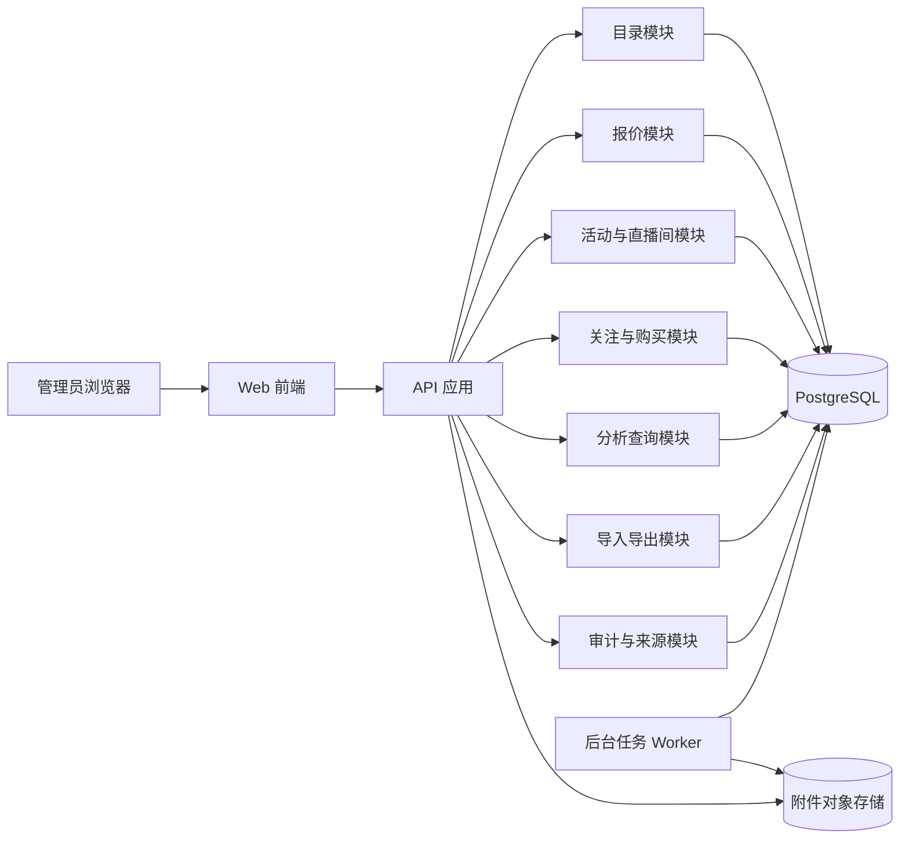
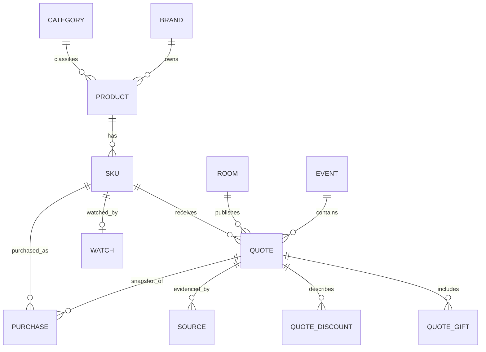
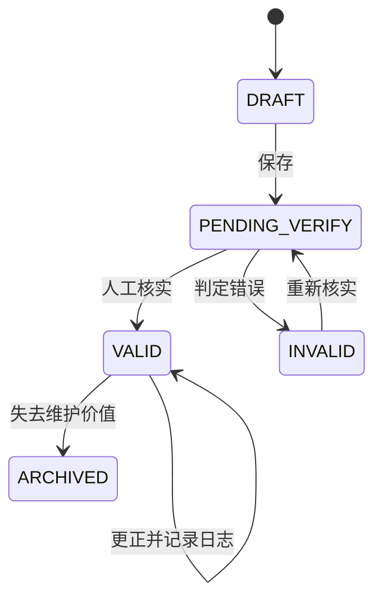

# 直播间价格趋势与购买决策后台：架构设计方案

- 版本：v1.0
- 依据文档：直播间价格趋势与购买决策后台 PRD v1.0
- 设计目标：用足够稳健的数据模型承载报价历史，同时保持个人项目的开发和维护成本可控。

## 1. 架构结论

第一阶段采用**模块化单体（Modular Monolith）+ PostgreSQL + 对象存储 + 前后端分离**。

推荐形态：

- 前端：React + TypeScript + Vite，负责后台页面、筛选、表单、趋势图和导入预览。
- 后端：FastAPI + SQLAlchemy 2.x + Pydantic；以 REST API 为主，适合表单、数据查询和批量导入。
- 主数据库：PostgreSQL。报价数量只有万级时足够，且日期、金额、JSON 扩展和全文检索能力成熟。
- 文件存储：开发阶段本地目录；需要更稳定时切换 MinIO 或兼容 S3 的对象存储。
- 部署：Docker Compose，包含 web、api、db；文件存储可作为独立 volume。
- 异步任务：第一版使用数据库任务表和后台 worker；只有接入自动采集或外部通知后再引入 Redis/Celery。
- 图表：前端基于后端返回的标准化时间序列绘制，默认不在浏览器自行计算历史最低价。

这套方案的关键取舍是：**先保持一个可调试、可备份的应用边界，把领域边界划清楚；不提前拆成微服务，也不提前建设数据仓库。**

## 2. 总体架构



所有写入通过领域模块完成，页面不直接写数据库。分析查询从报价的有效状态和统一口径生成，避免不同页面各自实现一套价格算法。

## 3. 分层和模块边界

### 3.1 接口层

职责：

- 认证、请求参数校验、分页、排序和错误格式。
- 将 DTO 转换为应用服务命令或查询。
- 不能包含“某个页面的临时计算逻辑”。

建议统一返回：

```json
{
  "data": {},
  "meta": {"request_id": "…", "page": 1, "page_size": 20}
}
```

错误格式：

```json
{
  "error": {
    "code": "QUOTE_SPEC_MISMATCH",
    "message": "该报价与当前规格不可比较",
    "details": {}
  }
}
```

### 3.2 应用层

每个用例一个应用服务，例如：

- CreateProduct
- CreateSku
- CreateQuote
- VerifyQuote
- CorrectQuote
- ImportQuoteBatch
- GetSkuTrend
- CompareEventQuotes
- SetWatchTarget
- RecordPurchase

应用服务负责事务边界、权限检查和调用领域规则，不直接把 ORM 对象暴露给接口层。

### 3.3 领域层

核心领域规则集中在这里：

- 规格是否可比较。
- 报价是否可以进入统计。
- 定金和尾款如何组成主价格。
- 条件报价是否属于通用报价。
- 活动内最低价如何确定。
- 报价更正如何保留历史日志。
- 用户购买记录如何保存报价快照。

领域层不依赖 HTTP、React 或具体数据库查询。

### 3.4 基础设施层

包括：

- PostgreSQL repositories。
- 文件存储适配器。
- CSV 解析器。
- 数据库迁移。
- 本地任务 worker。
- 日志、备份和系统时钟。

## 4. 核心领域模型

### 4.1 聚合关系



建议的聚合边界：

- Product 聚合：品牌、品类归属和商品生命周期。
- SKU 聚合：可比规格和版本；SKU 是报价比较的最小业务单位。
- Quote 聚合：一次直播间公开报价及其条件、赠品、来源和状态。
- Watch 聚合：用户针对某个 SKU 的目标价和意愿。
- Purchase 聚合：一次个人购买事实以及当时的报价快照。

Quote 不直接修改 Product 或 SKU 的规格字段。规格变更走新的 SKU 或显式版本修正流程。

## 5. 数据库设计

### 5.1 核心表

#### product

- id：UUID 或 BIGINT。
- brand_id、category_id。
- name、aliases、status。
- created_at、updated_at、archived_at。

#### sku

- id、product_id。
- version_label。
- package_description。
- net_quantity、quantity_unit。
- item_count。
- bundle_description。
- comparison_key。
- status、created_at、updated_at。

`comparison_key` 不由用户直接输入，用规范化字段生成，用于提示潜在重复和错误匹配。最终能否比较仍需经过业务规则检查。

#### room

- id、name、platform、host_name。
- source_url（可选）。
- status、notes。

#### event

- id、event_type、year、name。
- start_date、end_date。
- status。

#### quote

- id、sku_id、room_id、event_id（可空）。
- occurred_at、occurred_at_precision。
- amount_cents。
- pricing_scope：GENERAL / MEMBER / CONDITIONAL。
- quote_status：DRAFT / PENDING_VERIFY / VALID / INVALID / ARCHIVED。
- price_includes_live_coupon。
- deposit_cents、balance_cents（可空）。
- valid_until（可空）。
- shipping_note、condition_text。
- created_at、updated_at、verified_at。

主价格永远落在 `amount_cents`。若使用定金和尾款，保存明细并要求 `amount_cents = deposit_cents + balance_cents`；只有定金的记录不能进入 VALID。

#### quote_gift

- quote_id。
- name、quantity、quantity_unit。
- description。

#### quote_discount

- quote_id。
- type：PLATFORM / LIVE / MEMBER / OTHER。
- amount_cents（可空）。
- rule_text。
- is_included_in_quote。

`is_included_in_quote` 防止直播券既计入主价格、又被重复扣除。

#### source

- quote_id。
- source_type：SCREENSHOT / OFFICIAL_PAGE / PERSONAL_NOTE / OTHER。
- url、note。
- attachment_key、content_hash。
- captured_at。
- verification_status。

来源是证据，不是自动可信结论。报价必须经过人工核实才能进入默认统计。

#### watch

- sku_id。
- interest_level。
- purchase_intent。
- target_price_cents（可空）。
- note。
- created_at、updated_at。

#### purchase

- id、sku_id、quote_id（可空）。
- purchased_at、item_count。
- paid_amount_cents（可空）。
- quote_snapshot JSONB。
- note。

购买记录保存报价快照，不因后续报价修正而改变当时的记录。

#### audit_log

- id、actor_id（单用户方案可为空）。
- entity_type、entity_id。
- action、before_json、after_json、reason。
- created_at、request_id。

### 5.2 约束与索引

必须具备：

- amount_cents >= 0；有效报价通常要求大于 0。
- amount_cents、deposit_cents、balance_cents 一致性检查。
- occurred_at、录入时间、有效期分开存储。
- quote_status != VALID 的报价默认不参与统计。
- `(sku_id, occurred_at, room_id, amount_cents, pricing_scope)` 建立重复提示索引，重复仍允许人工确认。
- `quote(sku_id, quote_status, occurred_at)` 支撑趋势查询。
- `quote(event_id, sku_id, quote_status, amount_cents)` 支撑活动最低价。
- `watch(target_price_cents, sku_id)` 支撑目标价判断。
- 源附件使用 content_hash 去重。

金额用整数分，时间统一使用带时区的时间戳，业务默认时区为 Asia/Shanghai。

## 6. 报价生命周期



只有 VALID 且满足筛选范围的报价参与趋势和最低价。

“当前价格”在本系统中有两个概念：

- 最近记录报价：按发生时间排序的最新有效记录。
- 当前可购买报价：最近记录仍在有效期内，或人工确认仍有效。

有效期未知时可以展示最近记录，但必须标注“有效性待确认”，不能直接提示现在可购买。

## 7. 查询与价格分析架构

### 7.1 统一查询服务

所有趋势、活动比较、直播间比较都经过 `QuoteAnalyticsService`，输入：

- sku_id。
- 时间范围。
- 活动或直播间筛选。
- 是否包含条件报价。
- 截止日期（用于避免未来数据倒灌）。

输出：

- price_points。
- historical_low。
- previous_event_low。
- delta_amount。
- delta_percent。
- sample_count。
- label。
- data_scope。
- gift_changes。

这样可以防止商品详情页、活动页、首页各自计算出不同的最低价。

### 7.2 查询层实现

第一版使用“轻量 CQRS”：

- 写模型：规范化业务表。
- 读模型：SQL 查询、数据库视图和必要的聚合缓存。
- 不引入完整事件溯源，也不复制到独立数据仓库。
- 数据量达到数十万报价且趋势查询明显变慢时，再建立 `sku_price_daily` 或 `event_sku_summary` 物化表。

趋势查询必须按发生时间排序，并使用当前报价发生时间作为历史截点：

```text
历史参考报价.occurred_at <= 当前报价.occurred_at
AND quote_status = VALID
AND pricing_scope = GENERAL（默认）
AND sku_id = 当前规格
```

“已收录最低价”使用当前筛选范围的 MIN(amount_cents)。样本少于 3 条时输出样本不足，不输出强标签。赠品差异通过报价明细关联查询，不进入现金价格算法。

## 8. 导入架构

导入不能直接写入 quote 表，采用批次流程：


ImportBatch 记录文件、操作者、行数、成功数、失败数和状态。

校验分三层：

1. 格式校验：金额、日期、枚举和必填字段。
2. 关联校验：商品、SKU、直播间和活动是否能唯一匹配。
3. 业务校验：定金尾款、规格比较、报价重复和来源完整性。

导入结果必须做到可重试、可下载失败清单、不会静默丢行。导入的报价默认进入 PENDING_VERIFY，而不是直接 VALID。

## 9. API 设计

### 9.1 基础目录

- `GET /api/products`
- `POST /api/products`
- `GET /api/products/{id}`
- `POST /api/products/{id}/skus`
- `PATCH /api/skus/{id}`
- `GET /api/rooms`
- `GET /api/events`

### 9.2 报价

- `GET /api/quotes`
- `POST /api/quotes`
- `GET /api/quotes/{id}`
- `PATCH /api/quotes/{id}`
- `POST /api/quotes/{id}/verify`
- `POST /api/quotes/{id}/correct`
- `POST /api/quotes/{id}/archive`

### 9.3 分析

- `GET /api/skus/{id}/trend`
- `GET /api/skus/{id}/comparisons`
- `GET /api/events/{id}/skus/{sku_id}/summary`
- `GET /api/rooms/{id}/quotes`

### 9.4 关注与购买

- `GET /api/watches`
- `PUT /api/skus/{id}/watch`
- `POST /api/skus/{id}/purchases`
- `GET /api/purchases`
- `GET /api/notifications`

### 9.5 导入导出与附件

- `POST /api/imports/quotes`
- `GET /api/imports/{id}`
- `GET /api/imports/{id}/errors`
- `GET /api/exports/quotes`
- `POST /api/sources/presign`（采用对象存储时）

API 要求：游标或页码分页、白名单排序字段、筛选条件回显、幂等键支持导入提交、统一 request_id、避免把 SQL 过滤条件直接暴露给客户端。

## 10. 前端结构

推荐页面：

- Dashboard：关注商品、目标价命中、待核实报价。
- ProductList / ProductDetail：商品、规格和趋势。
- QuoteList / QuoteForm：报价录入、校验和来源。
- EventCompare：历年活动对比。
- RoomCompare：直播间对比。
- WatchList / PurchaseList：个人决策与复盘。
- ImportCenter：批次预览、错误清单和结果。
- Settings：品类、品牌、活动、备份。

商品详情页采用“结论卡片 + 趋势图 + 明细表 + 个人决策区”布局。所有趋势图下面都保留表格，避免图表成为唯一证据。

## 11. 任务与通知

第一版不必引入复杂消息系统：

- 新增报价提交后，在同一事务内生成待判断任务或由页面即时判断。
- 目标价命中记录写入 `notification` 表并做唯一约束。
- 过期检查可以每日由 worker 执行，更新有效性提示。
- CSV 解析超过几百行时交给 worker，页面轮询 ImportBatch 状态。

后续接入外部通知时，在 `NotificationChannel` 后面增加站内、邮件、企业微信等适配器，领域层不感知具体渠道。

## 12. 部署与备份

### 12.1 本地单机部署

Docker Compose 服务：

- frontend
- api
- worker
- postgres
- 可选 minio

数据目录分开挂载：

- PostgreSQL 数据卷。
- 附件对象目录。
- 备份目录。
- 应用日志目录。

### 12.2 备份策略

- 每日数据库逻辑备份。
- 附件按 content_hash 或对象路径同步备份。
- 备份包包含数据库、附件和版本信息。
- 每月执行一次恢复演练，确认可以恢复商品、报价、来源和购买快照。
- 导出的 CSV 不能替代数据库备份，因为它不包含所有审计关系和附件。

### 12.3 公网部署前提

如果未来部署到公网，必须补充：

- 管理员认证和密码策略。
- CSRF、防暴力破解、会话过期。
- 附件访问鉴权和文件类型限制。
- HTTPS、反向代理和定期依赖升级。
- 多用户的 owner_id、角色和审计人字段。

## 13. 可观测性与故障处理

最少记录：

- request_id、接口、耗时、状态码。
- 导入批次状态和失败原因。
- 报价统计查询耗时。
- 数据库迁移版本。
- worker 任务失败次数。

错误分为：

- 用户输入错误：返回可定位字段和修正提示。
- 业务冲突：例如规格不可比，返回明确业务错误码。
- 外部资源错误：附件存储或来源链接不可用，不影响已有报价历史。
- 系统错误：记录堆栈和 request_id，界面只展示通用错误。

## 14. 测试策略

优先测试数据口径，而不是只测页面渲染：

- 定金+尾款总价校验。
- 直播券是否重复扣减。
- 通用报价与条件报价的筛选。
- 同规格与不同规格的比较边界。
- 历史最低价是否受当前报价发生时间限制。
- 样本少于3条时不输出强标签。
- 赠品变化展示而不改变主价格。
- 报价更正后趋势更新、购买快照不变。
- 导入错误逐行返回且不产生半条数据。
- 目标价提醒幂等。

使用数据库集成测试验证聚合查询；价格规则使用纯函数单元测试；导入使用固定 CSV 样例和错误清单快照测试。

## 15. 演进路线

### V1.0：模块化单体

完成商品/规格、直播间/活动、报价、来源、趋势、关注、购买、导入导出。数据规模预期在万级，PostgreSQL 直接查询足够。

### V1.1：降低录入成本

增加批量核实、直播场次、来源附件管理、相似规格提示和更多可复用表单。

### V1.2：稳定的品类分析

建立固定可比 SKU 集合，增加活动摘要表和品类趋势，但每个指标同时展示集合范围和样本数。

### 后续：采集适配器

若未来获得稳定、合规的数据来源，增加：

- SourceAdapter：官方页面、合作接口、手工导入等。
- RawQuote：保存原始采集内容，不直接覆盖规范化 Quote。
- NormalizationJob：将原始数据映射到商品、SKU、报价。
- ReviewQueue：低置信度数据进入人工核实。

自动采集必须作为独立适配器接入，不能让采集逻辑侵入核心报价领域模型。

## 16. 主要风险与架构应对

| 风险 | 应对 |
| --- | --- |
| 同一商品不同规格被混比 | SKU 作为比较最小单位，规格字段结构化，比较前强校验 |
| 直播报价包含复杂条件 | pricing_scope、condition_text、优惠子表分开保存 |
| 历史数据缺失导致误判 | 展示样本数、数据范围和“已收录”措辞 |
| 赠品变化造成假优惠 | 赠品单独实体，趋势只计算现金报价 |
| 报价被后续更正 | 修改日志、报价状态和购买快照 |
| 自动采集来源不稳定 | 采集适配器与核心域隔离，先保存原始数据 |
| 过早拆微服务 | 先使用模块化单体，按实际瓶颈演进 |
| 附件丢失导致无法核验 | 对象存储、hash 去重、数据库与附件一起备份 |

## 17. 最终架构决策

1. 报价比较的最小单位是 SKU，不是模糊的商品名称。
2. Quote 是带状态、条件、来源和修订记录的事实，不把金额覆盖式更新。
3. 主价格只有一个 amount_cents；满减、赠品和实际支付均不改写它。
4. 所有分析页面调用同一个分析服务，保证历史最低价口径一致。
5. 先用模块化单体，不用微服务和数据仓库。
6. 先人工录入和批量导入，未来自动采集通过适配器接入。
7. 先把数据可信、可追溯、可恢复做好，再扩大直播间和品类范围。

